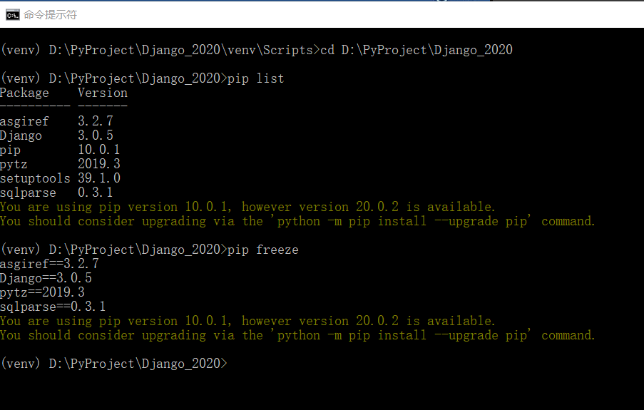
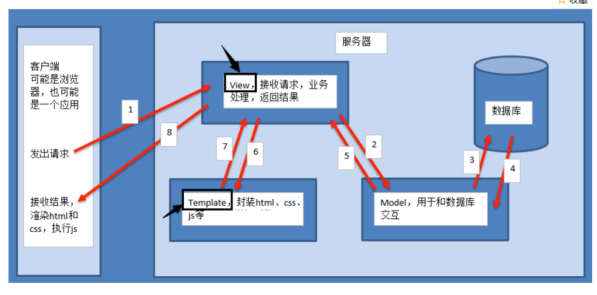

### Django学习笔记

### 网站参考
- [Django官网](https://www.djangoproject.com/)
- [Django中文网 2.0中文教程](https://www.django.cn/course/course-1.html)
- [Django 教程 菜鸟教程](https://www.runoob.com/django/django-tutorial.html)
- [Django 教程 W3CSchool](https://www.w3cschool.cn/django/)

### 其它参考
- 建议先看下Python_advanced_learning 中的:
    - 03_Python_network_programming--->005_MSGI_Mini_Web 框架项目，理解 web 框架的基本原理
    - MSGI_Mini_Web 框架实现了静态请求处理、动态请求处理、添加配置文件、添加路由功能、MySQL数据库查询等功能
    - [MSGI_Mini_Web 项目 GitHub 地址](https://github.com/FelixZFB/Python_advanced_learning/tree/master/03_Python_network_programming/005_MSGI_Mini_Web%E6%A1%86%E6%9E%B6)

# 1 Django 概述
## 1.1 为什么是 Django ?
- 使用Django，您可以在几个小时内将Web应用程序从概念转移到启动。
- Django负责Web开发的大部分麻烦，所以您可以专注于编写应用程序，而不需要重新发明方向盘。它是免费的，开源的。
- 速度快得离谱：Django的设计是为了帮助开发人员尽可能快地将应用程序从概念转移到完成。
- 功能丰富：Django包含了数十个可以用来处理常见Web开发任务的附加程序。Django负责用户身份验证、内容管理、站点地图、RSS提要和更多的任务--就在眼前。
- 安全可靠：Django非常重视安全性，并帮助开发人员避免许多常见的安全错误，例如SQL注入、跨站点脚本编写、跨站点请求伪造和点击劫持。它的用户认证系统为管理用户帐户和密码提供了一种安全的方法。
- 可扩展性：利用Django的能力，快速、灵活地扩展规模，以满足最大的使用需求。
- 适用性广：公司、组织和政府使用Django构建了各种各样的东西--从内容管理系统到社交网络，再到科学计算平台

## 1.2 Django 安装
- [Django官网](https://www.djangoproject.com/)
- Windows环境
    - Windows本地安装，直接CMD终端：
        - pip install django            自动拉取最新版
        - pip install django=3.0.5      安装指定版本
        - pip install --upgrade django  升级本地版本为最新版本
        - 由于我本地只安装了anaconda环境，没有安装其它python版本
        - pip直接安装都是安装在anaconda环境下的包里面
        
    - Ubuntu安装，安装方法类似
        - 先安装虚拟环境，新建一个虚拟环境，进入虚拟环境安装django和新建django项目
        - 参考Django框架教程新(HTML版_直接打开index查看)的1.1 1.2 
        - 以及 Django 教程网站的安装教程有详细说明
    - Pycharm安装(推荐使用该方法)
            - 方法1：进入虚拟环境后，安装pip安装
            - 方法2：直接pycharm里面包管理搜索安装
            - 添加pycharm源地址为国内镜像地址
            - 参考QQ浏览器收藏夹pycharm使用或[pycharm修改镜像源方法](https://blog.csdn.net/selfimpro_001/article/details/88670584)
            
            
- 注意：环境搭建
- Django安装和创建项目都在虚拟环境下面开始
        - 虚拟环境就是真实python环境的复制版
        - windows直接pycharm创建，然后CMD切换到Scripts下activate激活，就进入虚拟环境了
        - Ubuntu直接终端创建虚拟环境，创建后就自动进入虚拟环境了
        - Ubuntu具体步骤参考HTML版教程的 1.1 搭建环境。常用命令如下：
            - mkvirtualenv -p python3 py_django  创建python3下的虚拟环境名称py_django，-p参数用于指定python版本，默认是创建的python2
            - 工作在虚拟环境上，终端提示符最前面会出现"(虚拟环境名称)"。
            - 所有的虚拟环境，都位于/home/python/下的隐藏目录.virtualenvs下
            - deactivate                    退出虚拟环境
            - workon 两次tab键              查看所有虚拟环境
            - workon py_django              进入使用虚拟环境
            - rmvirtualenv py_django        删除虚拟环境，先退出：deactivate
            - pip install 包名称            虚拟环境中可以使用pip命令操作python包
            - pip list                      查看已安装的包
            - pip freeze                    查看已安装的包
            - 注意：在虚拟环境中不可使用sudo pip install 包名称 来安装python包，这样安装的包实际是安装在了真实的主机环境上。
        - virtualenv是如何创建“独立”的Python运行环境的呢？
            - 原理很简单，就是把系统Python复制一份到virtualenv的环境，
            - 用命令source venv/bin/activate进入一个virtualenv环境时，
            - virtualenv会修改相关环境变量，让命令python和pip均指向当前的virtualenv环境。
    
## 1.3 MVC    
- MVC框架的核心思想是：解耦，让不同的代码块之间降低耦合，增强代码的可扩展性和可移植性，实现向后兼容。
- 当前主流的开发语言如Java、PHP、Python中都有MVC框架 

- Web MVC各部分的功能
    - M全拼为Model，主要封装对数据库层的访问，对数据库中的数据进行增、删、改、查操作。
    - V全拼为View，用于封装结果，生成页面展示的html内容。
    - C全拼为Controller，用于接收请求，处理业务逻辑，与Model和View交互，返回结果。
    
    
     
## 1.4 Django 简介
- Django的主要目的是简便、快速的开发数据库驱动的网站。
    - 它强调代码复用，多个组件可以很方便的以"插件"形式服务于整个框架，
    - Django有许多功能强大的第三方插件，你甚至可以很方便的开发出自己的工具包。
    - 这使得Django具有很强的可扩展性。
    - 它还强调快速开发和DRY(Do Not Repeat Your self)原则。

- Django框架遵循MVC设计，并且有一个专有名词：MVT
    - MVT各部分的功能：
        - M全拼为Model，与MVC中的M功能相同，负责和数据库交互，进行数据处理。
        - V全拼为View，与MVC中的C功能相同，接收请求，进行业务处理，返回应答。
        - T全拼为Template，与MVC中的V功能相同，负责封装构造要返回的html。
        - 差异就在于黑线黑箭头标识出来的部分:
        
 
        
# 2 创建一个项目
## 2.1 创建 Django 项目
- 虚拟环境下，进入 01_StartProject 目录下执行创建项目命令：
    - django-admin startproject test1   
    - tree /f  查看文件夹 tree 树形结构
    
    - 项目各文件说明：
        - manage.py是项目管理文件，通过它管理项目。
        - 与项目同名的目录，此处为test1。
        - \_init_.py是一个空文件，作用是这个目录test1可以被当作包使用。
        - settings.py是项目的整体配置文件。
        - urls.py是项目的URL配置文件。
        - wsgi.py是项目与WSGI兼容的Web服务器入口，详细内容会在布署中讲到
        
## 2.2 创建应用
- 进入 test1 项目文件夹下创建应用，执行以下命令
    - python manage.py startapp booktest
    - tree /f  查看文件夹 tree 树形结构
    
    - 项目各文件说明：
        - \_init.py_是一个空文件，表示当前目录booktest可以当作一个python包使用。
        - tests.py文件用于开发测试用例，在实际开发中会有专门的测试人员，这个事情不需要我们来做。
        - models.py文件跟数据库操作相关。
        - views.py文件跟接收浏览器请求，进行处理，返回页面相关。
        - admin.py文件跟网站的后台管理相关。
        - migrations文件夹之后给大家介绍。

- 安装应用
    - 应用创建成功后，需要安装才可以使用，也就是建立应用和项目之间的关联，
    - 在test1/settings.py中INSTALLED_APPS下添加应用的名称就可以完成安装。
    - INSTALLED_APPS 列表元素末尾添加：'booktest',

- 开发服务器
    - 在开发阶段，为了能够快速预览到开发的效果，django提供了一个纯python编写的轻量级web服务器，仅在开发阶段使用。
    - 运行服务器命令如下,终端要切换到项目文件夹/test1下下执行：
        - python manage.py runserver ip:端口
        - python manage.py runserver
        - 可以不写IP和端口，默认IP是127.0.0.1，默认端口为8000。
        - 如果本地启动多个django服务器，可以指定不同的端口号，先进入各自项目的虚拟环境，然后切换到项目文件夹下，运行服务
        - python manage.py runserver 127.0.0.1:8000
        - python manage.py runserver 127.0.0.1:8001
        - python manage.py runserver 127.0.0.1:8002
        - 紧接着在浏览器中输入网址：127.0.0.1:8000，可以查看当前站点开发效果。
    - ctrl + c  退出服务器，按下后需要等待一小会儿才会停止服务器

# 3 Django 基本知识
- Django 项目整体说明，以第 2 节创建的 test1 为例
    - /test1/test1 里面是django项目整体配置
    - /test1/booktest 里面是应用的相关配置
    - db.sqlite3 是默认使用的数据库文件
    - manage.py 项目管理文件，通过它管理项目

## 3.1 设计模型 (models.py)
- ORM框架
    - O是object，也就类对象的意思，
    - R是relation，翻译成中文是关系，也就是关系数据库中数据表的意思，
    - M是mapping，是映射的意思。
    - 在ORM框架中，它帮我们把 类和数据表进行了一个映射，可以让我们通过类和类对象就能操作它所对应的表格中的数据。
    - ORM框架还有一个功能，它可以根据我们设计的类自动帮我们生成数据库中的表格，省去了我们自己建表的过程。
    

- django中内嵌了ORM框架，不需要直接面向数据库编程，而是定义模型类，通过模型类和对象完成数据表的增删改查操作。
    - 使用django进行数据库开发的步骤如下：
    - 1.在models.py中定义模型类
    - 2.迁移
    - 3.通过类和对象完成数据增删改查操作
 
     
## 3.2 模型类实例 (models.py)
- 注意：所有命令要终端要切换到项目文件夹/test1下下执行
    - 虚拟环境项目文件夹路径如下：
    - (venv) D:\PyProject\Django_2020\01_StartProject\test1> 
- 1.定义模型类
        - 模型类定义在/booktest/models.py文件中，继承自models.Model类。
- 2.迁移由两步完成: 
    - 注意：ctrl + c 退出服务器模式，虚拟环境下执行命令
    - 2.1.生成迁移文件：根据模型类生成创建表的迁移文件。
        - python manage.py makemigrations
        - 生成的迁移文件位置：/booktest/migrations/0001_initial.py
        - Django框架根据我们设计的模型类生成了迁移文件，
        - 在迁移文件中我们可以看到fields列表中每一个元素跟BookInfo类属性名以及属性的类型是一致的。
        - 同时我们发现多了一个id项，这一项是Django框架帮我们自动生成的，
        - 在创建表的时候id就会作为对应表的主键列，并且主键列自动增长。
        
    - 2.2.执行迁移：根据第一步生成的迁移文件在数据库中创建表。
        - python manage.py migrate
        - 生成的数据表文件位置：/test1/db.sqlite3
        - Django默认采用sqlite3数据库
        - 生成的数据表的默认名称为：
            - <app_name>_<model_name>
            - booktest_bookinfo
    - 上面执行结果如下：
    
    
- sqlite3数据库可视化操作：
    - sqlite3是一个轻量化的数据库，口语直接使用Navicat Premium软件打开文件操作
    - Navicat Premium--->文件--->新建连接--->Sqlite--->写上连接名--->现有数据库文件--->选择本地的sqlite3文件确定即可
    - 就可以打开查看操作数据库了
    
      
- 3.数据操作
    - 成数据表的迁移之后，下面就可以通过进入项目的shell，进行简单的API操作。
    - 如果需要退出项目，可以使用ctrl+d快捷键或输入quit()。
    - 进入项目shell的命令：
        - python manage.py shell
        - from booktest.models import BookInfo,HeroInfo  首先引入booktest/models中的类
        - BookInfo.objects.all()  查询所有图书信息
    
    - 第一次写入数据错误记录
        - 错误提示：django.db.utils.OperationalError: table booktest_bookinfo has no column named bpub_date
        - 错误原因：1 中定义模型将bpub_date写成bpub_title了，可以查看008图片
        - 错误解决：先修改模型中定义名称，然后重新生成迁移文件和执行迁移
        
    
    - 写入数据：
        - 进入shell终端后就可以，写入数据了，写入后记得保存
        - BookInfo.objects.all()  查看数据
        - 保存后，再次写入(实际是修改，因为用的是同一个实例对象)，然后保存，会直接覆盖之前的数据，参考下图
        
        - 注意：写入数据和查询数据都需要先创建一个实例对象
            - 写入数据时，创建类的实例对象：b=BookInfo()
            - 查询数据时，创建指定的实例对象，指定id值：b=BookInfo.objects.get(id=1)
    
    - 查询，修改，删除数据：
        - 注意：始终用同一个实例对象，就可以对该对象进行多个操作
        - 和写入时候一样，查询属性的值
        - 创建查询对象：b=BookInfo.objects.get(id=1) (注意：该处对象名称可以不用b,可以写成b1,避免混淆)
            - b.title
            - b.pub_date
        - 修改后需要执行保存命令：b.save
        - 删除数据：b.delete()
        - 具体参考下图，依次是查询-修改-删除
        
        
- 4.添加一个新的模型类，英雄类
    - models.py添加英雄类，注意设置外键时候django1.8版本以后需要on_delete参数，不然会报以下错误
        - __init__() missing 1 required positional argument: 'on_delete'
        - 生成迁移文件错误，可以直接删除migrations下面的0001和0002文件和db.sqlite3文件，然后重新执行生成文件和执行迁移命令
        - 详细参考以下两篇博文：
            - https://www.cnblogs.com/phyger/p/8035253.html
            - https://www.cnblogs.com/cpl9412290130/p/9608331.html
    - 分别执行生成迁移文件，执行迁移命令:
        - python manage.py makemigrations
        - python manage.py migrate
     
    - 图书与英雄是一对多的关系，django中提供了关联的操作方式。
        - 获得关联集合：返回当前book对象的所有hero
        - b.heroinfo_set.all()
        - 一（图书对象）对多（英雄名称类小写加上下划线和set）
- 5.操作补充：
    - 查询图书表里面的所有内容。
	    - BookInfo.objects.all()
	    - HeroInfo.objects.all()
	- 查询出id为2的图书中所有英雄人物的信息。
	    - 第一步，创建图书的对象：b = BookInfo.objects.get(id=2)
	    - 第二步，查询所有关联的英雄对象：b.heroinfo_set.all() #查询出b图书中所有英雄人物的信息

## 3.3 后台管理 (admin.py)
- Django能够根据定义的模型类自动地生成管理页面。
- 使用Django的管理模块，需要按照如下步骤操作：
    - 具体步骤查看Django框架教程HTML版 1.4 节
    - 1.管理界面本地化
        - 本地化是将显示的语言、时间等使用本地的习惯，
        - 这里的本地化就是进行中国化，中国大陆地区使用简体中文，时区使用亚洲/上海时区
        - 语言和时区的本地化。
        - 修改项目的settings.py文件(/test1/settings.py) 
    - 2.创建管理员
        - 创建管理员的命令如下，按提示输入用户名、邮箱、密码
        - 用户名：admin  邮箱和密码自定义设置（182...@qq.com, z1z)
        - 命令：python manage.py createsuperuser
        - 接下来启动服务器：python manage.py runserver （退出服务器 ctrl + c）
        - 打开浏览器，在地址栏中输入如下地址后回车：http://127.0.0.1:8000/admin/
        - 输入前面创建的用户名、密码完成登录
    - 3.注册模型类
        - 登录后台管理后，默认没有我们创建的应用中定义的模型类，
        - 需要在自己应用中的admin.py文件中注册，才可以在后台管理中看到，并进行增删改查操作
        - 默认没有我们创建的应用中定义的模型类，需要在自己应用中的booktest/admin.py文件中注册，才可以在后台管理中看到，并进行增删改查操作
    - 4.自定义管理页面
        - 自定义模型管理类。模型管理类就是告诉django在生成的管理页面上显示哪些内容
        - 列表页只显示出了BookInfo object，对象的其它属性并没有列出来，查看非常不方便。
        - Django提供了自定义管理页面的功能，比如列表页要显示哪些值。
        - 打开booktest/admin.py文件，自定义类，继承自admin.ModelAdmin类
        - 详细说明查看admin.py文件及其注释
    - 注意：
        - 后台管理默认显示的是
            - Bookinfo object(1)  
            - Bookinfo object(1)
        - 该名称是有/booktest/models.py中的__str__方法决定的
        - 我们可以修改该方法，让后台显示对象的名称，查看models.py

## 3.4 视图 (views.py) 
- 访问http://127.0.0.1:8000/admin/ 进入后台管理界面
- 服务器在收到这个请求之后，就一定对应着一个处理动作，这个处理动作就是帮我们产生页面内容并返回回来，这个过程是由视图来做的

- 对于django的设计框架MVT，用户在URL中请求的是视图，视图接收请求后进行处理，并将处理的结果返回给请求者

- 视图时需要进行两步操作：
    - 1.定义视图函数
        - 视图就是一个Python函数，被定义在views.py中
        - 视图的必须有一个参数，一般叫request，视图必须返回HttpResponse对象，HttpResponse中的参数内容会显示在浏览器的页面上。
        - 具体查看：booktest/views.py
    - 2.配置URLconf
        - 查找视图的过程：
            - 请求者在浏览器地址栏中输入url，请求到网站后，获取url信息，然后与编写好的URLconf逐条匹配，
            - 如果匹配成功则调用对应的视图函数，如果所有的URLconf都没有匹配成功，则返回404错误。
        - 一条URLconf包括url规则、视图两部分：
            - url规则使用正则表达式定义。
            - 视图就是在views.py中定义的视图函数。
        - 需要两步完成URLconf配置：
            - 1.在应用中定义URLconf，具体查看：booktest/urls.py
            - 2.包含到项目的URLconf中，应用中的urls.py需要自己新建，具体查看：test1/urls.py
        - 注意点：
            - urls文件，django2.0以前路径是使用的url，后面版本都使用path
            - 正则表达式需要严格匹配url地址的开头和结尾
     
     

## 3.5 模板 (templates) 
- 如何向请求者返回一个漂亮的页面呢？
    - 肯定需要用到html、css，如果想要更炫的效果还要加入js，问题来了，
    - 这么一堆字段串全都写到视图中，作为HttpResponse()的参数吗？这样定义就太麻烦了吧
    - 在Django中，将前端的内容定义在模板中，然后再把模板交给视图调用，各种漂亮、炫酷的效果就出现了

- 创建模板文件
    - 项目目录下创建模板文件夹：templates
    - 每个应用单独在模板下面创建一个应用同名的文件夹：booktest
    - 应用文件夹里面创建具体的模板文件，比如：index.html
    - 结构就是：test1/templates/booktest/index.html
    - 注意，settings.py 里面需要设置模板文件夹的路径

- 定义模板文件
    - templtes/booktest/index.html文件
    - 在模板中输出变量语法如下，变量可能是从视图中传递过来的，也可能是在模板中定义的
        - {{变量名}}
        - {{title}}
    - 在模板中编写代码段语法如下：
        - 
        - 
        - {{i}} 
        - 
        - 注意使用for循环代码后，末尾要写上结束代码
    - 具体查看index.html文件和views.py视图文件
    
- 视图调用模板
    - 1.找到模板
    - 2.定义上下文 context
    - 3.渲染模板 render
    - 具体查看views.py视图文件中index函数里面的方式2，使用模板文件
     
    
    
## 3.6 简单的综合实例
- 目标：请求一个网址，连接数据库，取出数据，展示在浏览器中
    - 请求该网址：http://127.0.0.1:8000/show_books
    - 浏览器展示所有的图书信息，
    - 请求该网址：http://127.0.0.1:8000/books/1
    - 浏览器显示图书信息以及包含的英雄信息
    - M全拼为Model: 模型，连接数据库，取出数据
    - V全拼为View：视图，接收request请求，进行业务处理，返回response。
    - T全拼为Template：模板，负责封装构造要返回的html。

- 具体步骤：
    - 包括三个方面，三个方面顺序不分先后。
    - 1.定义视图views.py
        - show_books函数：查询数据库，返回所有图书信息，然后调用模板，然后展示出来
        - detail函数：
            - 点击图书连接,连接里面包含图书的id，展示图书及英雄信息。
            - 图书id作为参数传给detail函数，然后获取图书关联的英雄信息
            - 返回信息，调用模板，然后展示出来
            - 正则表达式中的分组会自动作为参数传给视图中的函数
    - 2.定义URLconf, 应用booktest下的urls，项目test1下的urls上面3.4节中已经配置了
    - 3.定义模板文件

- 运行：
    - 启动服务器：python manage.py runserver
    - http://127.0.0.1:8000/show_books
    - 点击图书进入详情页：
        - http://127.0.0.1:8000/books/1
        - http://127.0.0.1:8000/books/2

