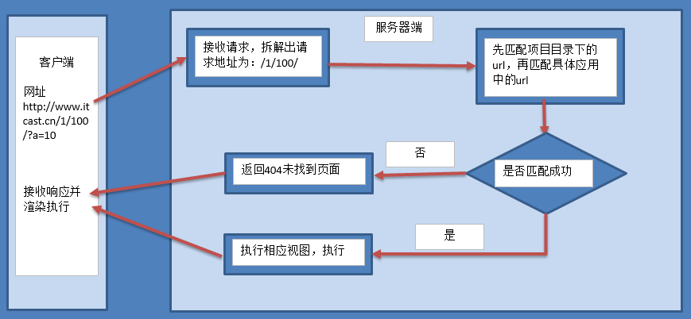
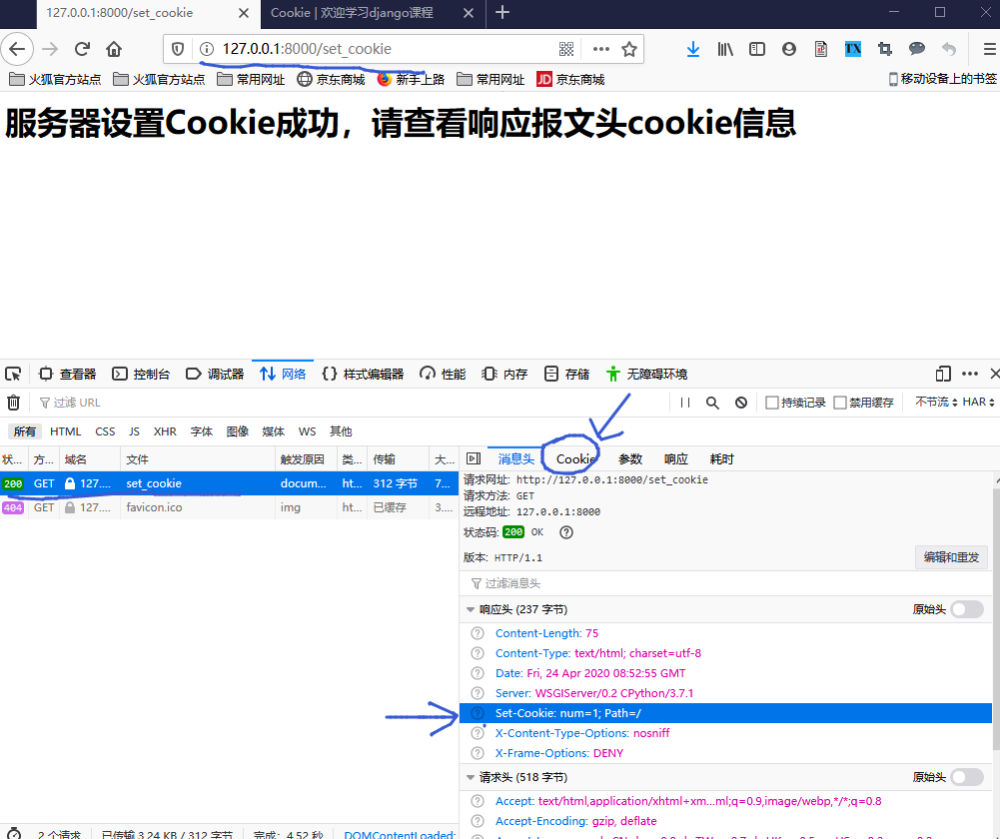
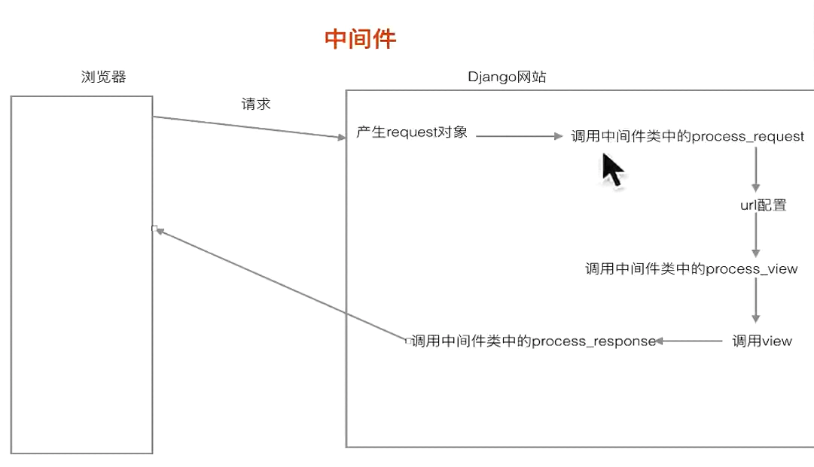

### Django学习笔记

### 网站参考
- [Django官网](https://www.djangoproject.com/)
- [Django中文网 2.0中文入门教程](https://www.django.cn/course/course-1.html)
- [Django 教程 菜鸟教程](https://www.runoob.com/django/django-tutorial.html)
- [Django 教程 W3CSchool](https://www.w3cschool.cn/django/)

### 其它参考
- 建议先看下Python_advanced_learning 中的:
    - 03_Python_network_programming--->005_MSGI_Mini_Web 框架项目，理解 web 框架的基本原理
    - MSGI_Mini_Web 框架实现了静态请求处理、动态请求处理、添加配置文件、添加路由功能、MySQL数据库查询等功能
    - [MSGI_Mini_Web 项目 GitHub 地址](https://github.com/FelixZFB/Python_advanced_learning/tree/master/03_Python_network_programming/005_MSGI_Mini_Web%E6%A1%86%E6%9E%B6)

# 1 Django 概述
## 1.1 为什么是 Django ?
- 使用Django，您可以在几个小时内将Web应用程序从概念转移到启动。
- Django负责Web开发的大部分麻烦，所以您可以专注于编写应用程序，而不需要重新发明方向盘。它是免费的，开源的。
- 速度快得离谱：Django的设计是为了帮助开发人员尽可能快地将应用程序从概念转移到完成。
- 功能丰富：Django包含了数十个可以用来处理常见Web开发任务的附加程序。Django负责用户身份验证、内容管理、站点地图、RSS提要和更多的任务--就在眼前。
- 安全可靠：Django非常重视安全性，并帮助开发人员避免许多常见的安全错误，例如SQL注入、跨站点脚本编写、跨站点请求伪造和点击劫持。它的用户认证系统为管理用户帐户和密码提供了一种安全的方法。
- 可扩展性：利用Django的能力，快速、灵活地扩展规模，以满足最大的使用需求。
- 适用性广：公司、组织和政府使用Django构建了各种各样的东西--从内容管理系统到社交网络，再到科学计算平台

## 1.2 Django 安装
- [Django官网](https://www.djangoproject.com/)
- Windows环境
    - Windows本地安装，直接CMD终端：
        - pip install django            自动拉取最新版
        - pip install django=3.0.5      安装指定版本
        - pip install --upgrade django  升级本地版本为最新版本
        - 由于我本地只安装了anaconda环境，没有安装其它python版本
        - pip直接安装都是安装在anaconda环境下的包里面
        
    - Ubuntu安装，安装方法类似
        - 先安装虚拟环境，新建一个虚拟环境，进入虚拟环境安装django和新建django项目
        - 参考Django框架教程新(HTML版_直接打开index查看)的1.1 1.2 
        - 以及 Django 教程网站的安装教程有详细说明
    - Pycharm安装(推荐使用该方法)
            - 方法1：进入虚拟环境后，安装pip安装
            - 方法2：直接pycharm里面包管理搜索安装
            - 添加pycharm源地址为国内镜像地址
            - 参考QQ浏览器收藏夹pycharm使用或[pycharm修改镜像源方法](https://blog.csdn.net/selfimpro_001/article/details/88670584)
            
            
- 注意：环境搭建
- Django安装和创建项目都在虚拟环境下面开始
        - 虚拟环境就是真实python环境的复制版
        - windows直接pycharm创建，然后CMD切换到Scripts下activate激活，就进入虚拟环境了
        - Ubuntu直接终端创建虚拟环境，创建后就自动进入虚拟环境了
        - Ubuntu具体步骤参考HTML版教程的 1.1 搭建环境。常用命令如下：
            - mkvirtualenv -p python3 py_django  创建python3下的虚拟环境名称py_django，-p参数用于指定python版本，默认是创建的python2
            - 工作在虚拟环境上，终端提示符最前面会出现"(虚拟环境名称)"。
            - 所有的虚拟环境，都位于/home/python/下的隐藏目录.virtualenvs下
            - deactivate                    退出虚拟环境
            - workon 两次tab键              查看所有虚拟环境
            - workon py_django              进入使用虚拟环境
            - rmvirtualenv py_django        删除虚拟环境，先退出：deactivate
            - pip install 包名称            虚拟环境中可以使用pip命令操作python包
            - pip list                      查看已安装的包
            - pip freeze                    查看已安装的包
            - 注意：在虚拟环境中不可使用sudo pip install 包名称 来安装python包，这样安装的包实际是安装在了真实的主机环境上。
        - virtualenv是如何创建“独立”的Python运行环境的呢？
            - 原理很简单，就是把系统Python复制一份到virtualenv的环境，
            - 用命令source venv/bin/activate进入一个virtualenv环境时，
            - virtualenv会修改相关环境变量，让命令python和pip均指向当前的virtualenv环境。
    
## 1.3 MVC    
- MVC框架的核心思想是：解耦，让不同的代码块之间降低耦合，增强代码的可扩展性和可移植性，实现向后兼容。
- 当前主流的开发语言如Java、PHP、Python中都有MVC框架 

- Web MVC各部分的功能
    - M全拼为Model，主要封装对数据库层的访问，对数据库中的数据进行增、删、改、查操作。
    - V全拼为View，用于封装结果，生成页面展示的html内容。
    - C全拼为Controller，用于接收请求，处理业务逻辑，与Model和View交互，返回结果。
    
    
     
## 1.4 Django 简介
- Django的主要目的是简便、快速的开发数据库驱动的网站。
    - 它强调代码复用，多个组件可以很方便的以"插件"形式服务于整个框架，
    - Django有许多功能强大的第三方插件，你甚至可以很方便的开发出自己的工具包。
    - 这使得Django具有很强的可扩展性。
    - 它还强调快速开发和DRY(Do Not Repeat Your self)原则。

- Django框架遵循MVC设计，并且有一个专有名词：MVT
    - MVT各部分的功能：
        - M全拼为Model，与MVC中的M功能相同，负责和数据库交互，进行数据处理。
        - V全拼为View，与MVC中的C功能相同，接收请求，进行业务处理，返回应答。
        - T全拼为Template，与MVC中的V功能相同，负责封装构造要返回的html。
        - 差异就在于黑线黑箭头标识出来的部分:
        
 
        
# 2 创建一个入门项目 (test1项目)
- 创建Django项目有两种方式：
    - 方式1：终端使用django命令创建
        - 先创建一个python项目
        - 进入项目虚拟环境
        - 虚拟环境下创建django项目
        - 该方法好处：每次都是进入同一个虚拟环境，虚拟环境下可以创建多个不同的django项目，比如后面的test1,test2,test3项目
    - 方式2：PyCharm中新建项目
        - 方式1：创建一个全新的django项目
            - pycharm打开后，创建项目时候就选择django
            - 一个全新的环境就直接选择新建一个全新的虚拟环境，会自动创建虚拟环境
            - 会自动创建项目，创建模板文件夹，moresettings里面还可以设置应用名称，自动创建应用
        - 方式2：已有的python项目中继续创建django项目
            - 比如Django_2020里面已经创建了test1,test2,test3项目
            - 我们使用pycharm创建test4项目，新建项目，选择django类型
            - 选择虚拟环境，选择Django_2020的虚拟环境即可
            - 创建后会重新打开一个pycharm窗口，里面只有test4，看不见venv虚拟环境文件夹
            - 我们可以关闭pycharm，然后重新打开Django_2020，里面就有test4项目
            - 该种方法创建的项目区别：项目下面会有一个idea文件夹，pycharm自己创建的，用于关联虚拟环境
            
    - 建议：
        - 直接方式1，终端创建项目，一个虚拟环境里面创建多个项目，相互独立共用一个虚拟环境
        - 要在哪里创建项目，就跳转到文件夹下执行命令
        - 比如新建03_test4文件夹，然后进入里面，创建test4项目

- 一个完整的项目创建标准步骤参考 6.1 节创建一个 test3 项目
    - 下面所有文件夹路径都是以项目/test3开始 
    - 1.创建项目：
        - 激活虚拟环境，进入02_test3文件夹下，执行创建项目命令：
        - django-admin startproject test3
    - 2.创建应用：
        - 进入到test3文件夹，执行创建应用命令：
        - python manage.py startapp booktest
        - 创建过程及项目结构如下：    
          
    - 3.在test3/settings.py中INSTALLED_APPS项安装注册应用 
        - 'booktest',   
    - 4.在test3/settings.py中TEMPLATES项配置模板查找路径。     
        - 先在test3项目下创建模板文件夹templates
        - 进入templates文件夹创建booktest文件夹
        - 然后settings.py配置模板路径：
        - 'DIRS': [os.path.join(BASE_DIR, 'templates')],
    - 5.配置mysql数据库，在test3/settings.py中DATABASES项配置使用MySQL数据库
        - 数据库直接使用test2项目，即 4.2 节已经创建好的django_test2数据库
        - settings.py中DATABASES参数进行数据库配置,具体查看settings.py文件，直接注释掉DATABASES原有所有内容的然后复制一份过去
        - 注意：启动django之前要启动mysql服务器
    - 6.配置静态文件夹路径
        - test3文件下，创建static文件夹，里面一般创建css,images,js三个文件夹，用于放置静态文件
        - STATICFILES_DIRS = [os.path.join(BASE_DIR, 'static')] # 设置静态文件的保存目录   
    - 7.本地化设置，设置中国语言和上海时间,具体查看settings.py文件：
        - LANGUAGE_CODE = 'zh-hans' #使用中国语言
        - TIME_ZONE = 'Asia/Shanghai' #使用中国上海时间，django设计时候没有北京时间
    - 8.使用模型(Model)
        - 定义模型类
        - 执行迁移：生成迁移命令，执行迁移命令
        - 具体查看3.2节
    - 9.使用视图(View)
        - 1.定义booktest/views.py视图函数
        - 2.配置URLconf，分别配置项目和应用(自己新建)下的urls.py文件,将视图函数和url对应起来
        - 具体查看3.4节和6.2节
    - 10.使用模板(Template)
        - 创建模板文件夹，定义模板文件，使用模板文件
        - 具体使用查看7.1节模板的使用
    - 11.后台管理员
        - 设置后台管理员admin超级账号
        - 具体查看 3.3 节 后台管理


## 2.1 创建 Django 项目
- Django_2020的python项目虚拟环境下，进入 01_StartProject 目录下执行创建项目命令：
    - django-admin startproject test1   
    - tree /f  查看文件夹 tree 树形结构
    
    - 项目各文件说明：
        - manage.py是项目管理文件，通过它管理项目。
        - 与项目同名的目录，此处为test1。
        - \_init_.py是一个空文件，作用是这个目录test1可以被当作包使用。
        - settings.py是项目的整体配置文件。
        - urls.py是项目的URL配置文件。
        - wsgi.py是项目与WSGI兼容的Web服务器入口，详细内容会在布署中讲到
        
## 2.2 创建应用
- 进入 test1 项目文件夹下创建应用，执行以下命令
    - python manage.py startapp booktest
    - tree /f  查看文件夹 tree 树形结构
    
    - 项目各文件说明：
        - \_init.py_是一个空文件，表示当前目录booktest可以当作一个python包使用。
        - tests.py文件用于开发测试用例，在实际开发中会有专门的测试人员，这个事情不需要我们来做。
        - models.py文件跟数据库操作相关。
        - views.py文件跟接收浏览器请求，进行处理，返回页面相关。
        - admin.py文件跟网站的后台管理相关。
        - migrations文件夹之后给大家介绍。

- 安装应用
    - 应用创建成功后，需要安装才可以使用，也就是建立应用和项目之间的关联，
    - 在test1/settings.py中INSTALLED_APPS下添加应用的名称就可以完成安装。
    - INSTALLED_APPS 列表元素末尾添加：'booktest',

- 开发服务器
    - 在开发阶段，为了能够快速预览到开发的效果，django提供了一个纯python编写的轻量级web服务器，仅在开发阶段使用。
    - 运行服务器命令如下,终端要切换到项目文件夹/test1下下执行：
        - python manage.py runserver ip:端口
        - python manage.py runserver
        - 可以不写IP和端口，默认IP是127.0.0.1，默认端口为8000。
        - 如果本地启动多个django服务器，可以指定不同的端口号，先进入各自项目的虚拟环境，然后切换到项目文件夹下，运行服务
        - python manage.py runserver 127.0.0.1:8000
        - python manage.py runserver 127.0.0.1:8001
        - python manage.py runserver 127.0.0.1:8002
        - 紧接着在浏览器中输入网址：127.0.0.1:8000，可以查看当前站点开发效果。
    - ctrl + c  退出服务器，按下后需要等待一小会儿才会停止服务器


# 3 Django 基本知识 (test1项目)
- Django 项目整体说明，以第 2 节创建的 test1 为例
    - /test1/test1 里面是django项目整体配置
    - /test1/booktest 里面是应用的相关配置
    - db.sqlite3 是默认使用的数据库文件
    - manage.py 项目管理文件，通过它管理项目

## 3.1 设计模型 (models.py)
- ORM框架
    - O是object，也就类对象的意思，
    - R是relation，翻译成中文是关系，也就是关系数据库中数据表的意思，
    - M是mapping，是映射的意思。
    - 在ORM框架中，它帮我们把 类和数据表进行了一个映射，可以让我们通过类和类对象就能操作它所对应的表格中的数据。
    - ORM框架还有一个功能，它可以根据我们设计的类自动帮我们生成数据库中的表格，省去了我们自己建表的过程。
    

- django中内嵌了ORM框架，不需要直接面向数据库编程，而是定义模型类，通过模型类和对象完成数据表的增删改查操作。
    - 使用django进行数据库开发的步骤如下：
    - 1.在models.py中定义模型类
    - 2.迁移
    - 3.通过类和对象完成数据增删改查操作

- 通过模型类进行MySQL数据库的增删改查，面向数据库编程转变成面向对象编程
    - 实际底部是面向对象增删改查通过django的ORM框架转换为mysql语句
     
## 3.2 模型类实例 (models.py)
- 注意：所有命令要终端要切换到项目文件夹/test1下下执行
    - 虚拟环境项目文件夹路径如下：
    - (venv) D:\PyProject\Django_2020\01_StartProject\test1> 
- 1.定义模型类
        - 模型类定义在/booktest/models.py文件中，继承自models.Model类。
- 2.迁移由两步完成: 
    - 注意：ctrl + c 退出服务器模式，虚拟环境下执行命令
    - 2.1.生成迁移文件：根据模型类生成创建表的迁移文件。
        - python manage.py makemigrations
        - 生成的迁移文件位置：/booktest/migrations/0001_initial.py
        - Django框架根据我们设计的模型类生成了迁移文件，
        - 在迁移文件中我们可以看到fields列表中每一个元素跟BookInfo类属性名以及属性的类型是一致的。
        - 同时我们发现多了一个id项，这一项是Django框架帮我们自动生成的，
        - 在创建表的时候id就会作为对应表的主键列，并且主键列自动增长。
        
    - 2.2.执行迁移：根据第一步生成的迁移文件在数据库中创建表。
        - python manage.py migrate
        - 生成的数据表文件位置：/test1/db.sqlite3
        - Django默认采用sqlite3数据库
        - 生成的数据表的默认名称为：
            - <app_name>_<model_name>
            - booktest_bookinfo
    - 上面执行结果如下：
    
    
- sqlite3数据库可视化操作：
    - sqlite3是一个轻量化的数据库，口语直接使用Navicat Premium软件打开文件操作
    - Navicat Premium--->文件--->新建连接--->Sqlite--->写上连接名--->现有数据库文件--->选择本地的sqlite3文件确定即可
    - 就可以打开查看操作数据库了
    
      
- 3.数据操作
    - 成数据表的迁移之后，下面就可以通过进入项目的shell，进行简单的API操作。
    - 如果需要退出项目，可以使用ctrl+d快捷键或输入quit()。
    - 进入项目shell的命令：
        - python manage.py shell
        - from booktest.models import BookInfo,HeroInfo  首先引入booktest/models中的类
        - BookInfo.objects.all()  查询所有图书信息
    
    - 第一次写入数据错误记录
        - 错误提示：django.db.utils.OperationalError: table booktest_bookinfo has no column named bpub_date
        - 错误原因：1 中定义模型将bpub_date写成bpub_title了，可以查看008图片
        - 错误解决：先修改模型中定义名称，然后重新生成迁移文件和执行迁移
        
    
    - 写入数据：
        - 进入shell终端后就可以，写入数据了，写入后记得保存
        - BookInfo.objects.all()  查看数据
        - 保存后，再次写入(实际是修改，因为用的是同一个实例对象)，然后保存，会直接覆盖之前的数据，参考下图
        
        - 注意：写入数据和查询数据都需要先创建一个实例对象
            - 写入数据时，创建类的实例对象：b=BookInfo()
            - 查询数据时，创建指定的实例对象，指定id值：b=BookInfo.objects.get(id=1)
    
    - 查询，修改，删除数据：
        - 注意：始终用同一个实例对象，就可以对该对象进行多个操作
        - 和写入时候一样，查询属性的值
        - 创建查询对象：b=BookInfo.objects.get(id=1) (注意：该处对象名称可以不用b,可以写成b1,避免混淆)
            - b.title
            - b.pub_date
        - 修改后需要执行保存命令：b.save
        - 删除数据：b.delete()
        - 具体参考下图，依次是查询-修改-删除
        
        
- 4.添加一个新的模型类，英雄类
    - models.py添加英雄类，注意设置外键时候django1.8版本以后需要on_delete参数，不然会报以下错误
        - __init__() missing 1 required positional argument: 'on_delete'
        - 生成迁移文件错误，可以直接删除migrations下面的0001和0002文件和db.sqlite3文件，然后重新执行生成文件和执行迁移命令
        - 详细参考以下两篇博文：
            - https://www.cnblogs.com/phyger/p/8035253.html
            - https://www.cnblogs.com/cpl9412290130/p/9608331.html
    - 分别执行生成迁移文件，执行迁移命令:
        - python manage.py makemigrations
        - python manage.py migrate
     
    - 图书与英雄是一对多的关系，django中提供了关联的操作方式。
        - 获得关联集合：返回当前book对象的所有hero
        - b.heroinfo_set.all()
        - 一（图书对象）对多（英雄名称类小写加上下划线和set）
- 5.操作补充：
    - 查询图书表里面的所有内容。
	    - BookInfo.objects.all()
	    - HeroInfo.objects.all()
	- 查询出id为2的图书中所有英雄人物的信息。
	    - 第一步，创建图书的对象：b = BookInfo.objects.get(id=2)
	    - 第二步，查询所有关联的英雄对象：b.heroinfo_set.all() #查询出b图书中所有英雄人物的信息


## 3.3 后台管理 (admin.py)
- Django能够根据定义的模型类自动地生成管理页面。
- 使用Django的管理模块，需要按照如下步骤操作：
    - 具体步骤查看Django框架教程HTML版 1.4 节
    - 1.管理界面本地化
        - 本地化是将显示的语言、时间等使用本地的习惯，
        - 这里的本地化就是进行中国化，中国大陆地区使用简体中文，时区使用亚洲/上海时区
        - 语言和时区的本地化。
        - 修改项目的settings.py文件(/test1/settings.py) 
    - 2.创建管理员
        - 创建管理员的命令如下，按提示输入用户名、邮箱、密码
        - 用户名：admin  邮箱和密码自定义设置（182...@qq.com, z1z)
        - 命令：python manage.py createsuperuser
        - 接下来启动服务器：python manage.py runserver （退出服务器 ctrl + c）
        - 打开浏览器，在地址栏中输入如下地址后回车：http://127.0.0.1:8000/admin/
        - 输入前面创建的用户名、密码完成登录
    - 3.注册模型类
        - 登录后台管理后，默认没有我们创建的应用中定义的模型类，
        - 需要在自己应用中的admin.py文件中注册，才可以在后台管理中看到，并进行增删改查操作
        - 默认没有我们创建的应用中定义的模型类，需要在自己应用中的booktest/admin.py文件中注册，才可以在后台管理中看到，并进行增删改查操作
    - 4.自定义管理页面
        - 自定义模型管理类。模型管理类就是告诉django在生成的管理页面上显示哪些内容
        - 列表页只显示出了BookInfo object，对象的其它属性并没有列出来，查看非常不方便。
        - Django提供了自定义管理页面的功能，比如列表页要显示哪些值。
        - 打开booktest/admin.py文件，自定义类，继承自admin.ModelAdmin类
        - 详细说明查看admin.py文件及其注释
        - 查看test1和test2项目里面admin.py的区别
    - 注意：
        - 后台管理默认显示的是
            - Bookinfo object(1)  
            - Bookinfo object(2)
        - 该名称是有/booktest/models.py中的__str__方法决定的
        - 我们可以修改该方法，让后台显示对象的名称，查看models.py
        - 注意：admin.py中设置对象展示方式后该方法自动忽略
- 注意：
    - 1、后台管理超级账户admin，同一个虚拟环境只需要创建一次即可？
    - 2、还是同一个站点http://127.0.0.1:8000/admin/只需创建一次即可以共用？
    - test2项目创建后，test3未创建，可以直接使用该账号登陆

## 3.4 视图 (views.py) 
- 访问http://127.0.0.1:8000/admin/ 进入后台管理界面
- 服务器在收到这个请求之后，就一定对应着一个处理动作，这个处理动作就是帮我们产生页面内容并返回回来，这个过程是由视图来做的

- 对于django的设计框架MVT，用户在URL中请求的是视图，视图接收请求后进行处理，并将处理的结果返回给请求者

- 视图时需要进行两步操作：
    - 1.定义视图函数
        - 视图就是一个Python函数，被定义在views.py中
        - 视图的必须有一个参数，一般叫request，视图必须返回HttpResponse对象，HttpResponse中的参数内容会显示在浏览器的页面上。
        - 具体查看：booktest/views.py
    - 2.配置URLconf
        - 查找视图的过程：
            - 请求者在浏览器地址栏中输入url，请求到网站后，获取url信息，然后与编写好的URLconf逐条匹配，
            - 如果匹配成功则调用对应的视图函数，如果所有的URLconf都没有匹配成功，则返回404错误。
        - 一条URLconf包括url规则、视图两部分：
            - url规则使用正则表达式定义。
            - 视图就是在views.py中定义的视图函数。
        - 需要两步完成URLconf配置：
            - 1.在应用中定义URLconf，具体查看：booktest/urls.py
            - 2.包含到项目的URLconf中，应用中的urls.py需要自己新建，具体查看：test1/urls.py
        - 注意点：
            - urls文件，django2.0以前路径是使用的url，后面版本都使用path
            - 正则表达式需要严格匹配url地址的开头和结尾
        - URL匹配说明：
            - http://127.0.0.1:8000/index?a=1&b=2&c=3
            - 视图函数url匹配时候：/之前的http://127.0.0.1:8000是主域名不参加匹配
            - ?后面的是参数，是传给后台的参数，也不参加匹配
            - 实际视图中查找匹配的url只有/ ?之间的index
     
     


## 3.5 模板 (templates) 
- 如何向请求者返回一个漂亮的页面呢？
    - 肯定需要用到html、css，如果想要更炫的效果还要加入js，问题来了，
    - 这么一堆字段串全都写到视图中，作为HttpResponse()的参数吗？这样定义就太麻烦了吧
    - 在Django中，将前端的内容定义在模板中，然后再把模板交给视图调用，各种漂亮、炫酷的效果就出现了

- 创建模板文件
    - 项目目录下创建模板文件夹：templates
    - 每个应用单独在模板下面创建一个应用同名的文件夹：booktest
    - 应用文件夹里面创建具体的模板文件，比如：index.html
    - 结构就是：test1/templates/booktest/index.html
    - 注意，settings.py 里面需要设置模板文件夹的路径

- 定义模板文件
    - templtes/booktest/index.html文件
    - 在模板中输出变量语法如下，变量可能是从视图中函数以字典方式传递过来的，也可能是在模板中定义的
        - {{变量名}}
        - {{title}}
    - django框架在前端页面中的代码格式：
        - 在模板中html文件中编写代码段语法如下：
        - 
        - 
        - {{代码中变量或者views视图传递过来的变量}}
        - {{i}}<br>
        - 
        - 注意使用for循环代码后，末尾要写上结束代码
    - 注释的格式：
        - {#注释的具体内容#}
    - 具体查看/test1/templates/booktest/index.html和detail.html文件和views.py视图文件
    
- 视图调用模板
    - 1.找到模板
    - 2.定义上下文 context
    - 3.渲染模板 render
    - 具体查看views.py视图文件中index函数里面的方式2，使用模板文件
     
    
    
## 3.6 简单的综合实例
- 目标：请求一个网址，连接数据库，取出数据，展示在浏览器中
    - 请求该网址：http://127.0.0.1:8000/show_books
    - 浏览器展示所有的图书信息，
    - 请求该网址：http://127.0.0.1:8000/books/1
    - 浏览器显示图书信息以及包含的英雄信息
    - M全拼为Model: 模型，连接数据库，取出数据
    - V全拼为View：视图，接收request请求，进行业务处理，返回response。
    - T全拼为Template：模板，负责封装构造要返回的html。

- 具体步骤：
    - MVT完成包括三个方面，三个方面顺序不分先后:
    - 1.定义模型models.py
    - 2.定义视图views.py
        - show_books函数：查询数据库，返回所有图书信息，然后调用模板，然后展示出来
        - detail函数：
            - 点击图书连接,连接里面包含图书的id，展示图书及英雄信息。
            - 图书id作为参数传给detail函数，然后获取图书关联的英雄信息
            - 返回信息，调用模板，然后展示出来
            - 正则表达式中的分组会自动作为参数传给视图中的函数
        - 定义URLconf, 应用booktest下的urls，项目test1下的urls上面3.4节中已经配置了
    - 3.定义模板文件，主要是html文件

- 运行：
    - 启动服务器：python manage.py runserver
    - http://127.0.0.1:8000/show_books
    - 点击图书进入详情页：
        - http://127.0.0.1:8000/books/1
        - http://127.0.0.1:8000/books/2

# 4 Django 使用 MySQL 数据库实例 (test2项目)
## 4.1 Django 中的 ORM
- ORM，全拼Object-Relation Mapping，中文意为对象-关系映射，是随着面向对象的软件开发方法发展而产生的。
- 在MVC框架中的Model模块中都包括ORM，对于开发人员主要带来了如下好处：
    - 实现了数据模型与数据库的解耦，通过简单的配置就可以轻松更换数据库，而不需要修改代码。
    - 只需要面向对象编程，不需要面向数据库编写代码。
    - 在MVC中Model中定义的类，通过ORM与关系型数据库中的表对应，对象的属性体现对象间的关系，这种关系也被映射到数据表中。

- Django框架中ORM示意图如下:
 

## 4.2 Django 配置 MySQL 数据库
- Django默认使用的是sqlite3轻量化数据库，以项目test2为例
- Django配置使用MySQL数据库

- 1.创建项目test2
    - 在/Django_2020/01_StartProject目录下创建项目test2 (里面已有第 3 章创建的 test1 项目)
    - 激活进入Django_2020项目虚拟环境，切换到01_StartProject文件夹下创建项目：
    - 执行命令：django-admin startproject test2
    - 项目结构如下：
        ```
        - test2
            - manage.py
            │
            └─test2
                asgi.py
                settings.py
                urls.py
                wsgi.py
                __init__.py
        ```
- 2.test2项目下创建应用booktest
    - 切换到test2目录下，执行命令：
    - python manage.py startapp booktest
    - 注册应用，/test2/settings.py中的INSTALLED_APPS列表末尾添加
    - 'booktest', # 注册自定义的应用，注意逗号写上
    
- 3.数据库配置，使用mysql数据库
    - DATABASE配置mysql数据库：
        - 将引擎改为mysql，提供连接的主机HOST、端口PORT、数据库名NAME、用户名USER、密码PASSWORD
        - 修改/test2/settings.py中的DATABASES，将默认的sqlite3的两行代码注释掉，具体设置如下：
        - 先本地进入mysql数据库，创建一个django_test2作为本项目使用的数据库
        - 创建命令：create database django_test2 charset=utf8;
        - 注意：数据库 Django框架不会自动生成，需要我们自己进入mysql数据库去创建，使用上面命令
            ```python
            DATABASES = {
                'default': {
                    # 'ENGINE': 'django.db.backends.sqlite3',
                    # 'NAME': os.path.join(BASE_DIR, 'db.sqlite3'),
                    'ENGINE': 'django.db.backends.mysql', #使用mysql数据库
                    'NAME': 'django_test2', #使用的数据库database的名字，已经提取创建好
                    'USER': 'root', #数据库登录用户名，默认就是root
                    'PASSWORD': '00116656', #数据库登录密码,数据库安装时候设置的用户密码
                    'HOST': 'localhost', #数据库所在主机的IP地址，本机直接用localhost
                    'PORT': '3306', #数据库端口，默认就是3306
                }
            }
            ```    
    - 安装pymysql包，配置pymysql：
        - 安装pymysql包，用于python连接操作mysql数据库
        - 虚拟环境下执行：pip install pymysql
        - /test2/\__init\__.py文件中配置pymsql，加入以下两句代码：
            - import pymysql
            - pymysql.install_as_MySQLdb()
    - 注意：django2.2以后使用mysqlclient包，参考下面
            
        
- 4. 启动服务器：
- 运行：
    - 启动服务器：python manage.py runserver
    - http://127.0.0.1:8000
    - 注意：启动django之前要启动mysql服务器
    
- 版本兼容性问题：
    - 注意上面mysql配置对于django2.2之前版本没有问题，但是2.2之后会报错：
    - ImproperlyConfigured: mysqlclient 1.3.13 or newer is required
    - 解决方法：
        - 卸载pymysql包：pip uninstall pymysql
        - 注释掉/test2/\__init\__.py中添加的两行代码
        - 安装mysqlclient包：pip install mysqlclient
        - django 2.2以后都是使用mysqlclient包了
        - 具体参考该博文：
        - [django 2.2与mysql兼容性问题](https://blog.csdn.net/lpw_cn/article/details/103978909)
         
         
    - pymysql和mysqlclient操作mysql数据库区别：
        - 导入的包不同
        - mysqlclient创建连接比pymysql前面多加一个MySQLdb
        - 就是创建连接时候有点区别，其它操作都一样
        - 具体参考下面对比图：
         
        - 博文参考：[通过mysqlclient操作MySQL数据库]()

- 上面步骤都成功后，django配置mysql数据库完成。
       
## 4.3 设计模型
- /booktest/model.py自定义模型，具体查看模型文件
- 生成迁移文件和执行迁移命令，让其在mysql数据库中生成和模型内相应的数据表
    - python manage.py makemigrations
    - python manage.py migrate
    
## 4.4 启动查看数据库
- 打开一个终端，启动本地mysql数据库
    - 使用dango_test2数据库文件：use dango_test2; 
    - 查看是否有自定义的模型对应的数据表：show tables;
    - 查看数据表详细信息：
        - desc booktest_bookinfo;
        - desc booktest_heroinfo;
         
        
## 4.5 数据库操作
- mysql终端插入数据，然后进django后台查看
- 后台管理，参考3.3节，修改test2/settings.py和booktest/admin.py
    - 1.本地化设置
    - 2.创建管理员
    - 3.注册模型
    - 4.自定义展示后台内容
- 启动django服务器进入后台
    - python manage.py runserver
    - http://127.0.0.1:8000/admin
     
    
## 4.6 项目 MVT 配置
- M模型4.3已经完成
    - 编写/booktest/models.py文件

- V视图(参考3.4节)
    - 定义视图函数: /booktst/views.py
    - 配置URLconf(应用和项目下的urls.py): 
        - /booktst/urls.py
        - /test2/urls.py
    - from booktest import views 导入时候注意问题：
        - 此处导入注意，由于test1和test2项目文件都标记为了source root
        - 此处搜索booktest时候开始按循序先搜到了test1文件中的，然后导入的views就是test1中的
        - 解决方法，不同项目尽量不要使用相同的名称，可以避免
        - 折中方法：先取消test1文件夹标记，test2标记，test1标记时候取消test2标记

- T模板(参考3.5节)
    - 创建模板文件: /templates/booktest/
        - index.html
        - detail.html
    - 配置模板文件路径: /test2/settings.py 中设置

- 服务器运行状态，访问
    - http://127.0.0.1:8000/index    图书列表首页
    - http://127.0.0.1:8000/books/1  或者2或者3图书详情页
    - 图书列表展示_图书详情展示_新增图书_删除图书执行效果如下：
         
  

# 5 模型(Model)深入 (test2项目)
- 模型类创建、操作、及mysql数据库操作查看第4章test2项目
    - test1项目，使用是默认的sqlite3数据库
    - 注意：不同的项目使用同一个数据库时候，不同项目里面的模型类名称不要重复，不然会出错
## 5.1 定义属性
- Django根据属性的类型确定以下信息：
    - 当前选择的数据库支持字段的类型
    - 渲染管理表单时使用的默认html控件
    - 在管理站点最低限度的验证

- django会为表创建自动增长的主键列，每个模型只能有一个主键列，如果使用选项设置某属性为主键列后django不会再创建自动增长的主键列    
- 默认创建的主键列属性为id，可以使用pk代替，pk全拼为primary key。
    - 注意：pk是主键的别名，若主键名为id2，那么pk是id2的别名。

- 属性命名限制：
    - 不能是python的保留关键字。
    - 不允许使用连续的下划线(间断的单下划线可以)，这是由django的查询方式决定的，在第4节会详细讲解查询。
    - 定义属性时需要指定字段类型，通过字段类型的参数指定选项，语法如下：

- 属性 = models.字段类型(选项)
    - 比如以下模型属性：
        - hname = models.CharField(max_length=20)
        - hgender = models.BooleanField()
        - bpub_date = models.DateField()

## 5.2 字段类型
- 属性 = models.字段类型(选项)
- 使用时需要引入django.db.models包，字段类型如下：
    - 常用类型：
    - BooleanField：布尔字段，值为True或False。用于性别。
    - CharField(max_length=字符长度)：字符串。
        - 参数max_length表示最大字符个数。
        - 必须有长度参数
    - IntegerField：整数。
    - DateField[auto_now=False, auto_now_add=False])：日期(年月日)。
        - 参数auto_now表示每次保存对象时，自动设置该字段为当前时间，用于"最后一次修改"的时间戳，它总是使用当前日期，默认为false。
            - auto_now=True，表示属性的值使用更新的时间，自动修改为更新的时间
        - 参数auto_now_add表示当对象第一次被创建时自动设置当前时间，用于创建的时间戳，它总是使用当前日期，默认为false。
            - auto_now_add=True 表示属性的值使用创建的时间
        - 参数auto_now_add和auto_now是相互排斥的，组合将会发生错误。
        - 一般不用指定参数，两个要指定True时候只能指定一个，不然会产生冲突。
        - 频繁修改情况可以使用auto_now=True
    - TimeField：时间(时分秒)，参数同DateField。
    - DateTimeField：日期时间(年月日时分秒)，参数同DateField。  
    - FileField：上传文件字段。
    - ImageField：继承于FileField，对上传的内容进行校验，确保是有效的图片。
    - DecimalField(max_digits=None, decimal_places=None)：十进制浮点数。
        - 参数max_digits表示总位数。
        - 参数decimal_places表示小数位数。
        - 用于表示价格等精准数字
    - FloatField：浮点数。
        - 常用数字，参数同上  
        
    - 不常用类型：
    - AutoField：自动增长的IntegerField，通常不用指定，不指定时Django会自动创建属性名为id的自动增长属性。
    - NullBooleanField：支持Null、True、False三种值。
    - TextField：大文本字段，一般超过4000个字符时使用。
        
## 5.3 选项
- 属性 = models.字段类型(选项)
- 通过选项实现对字段的约束，选项如下：
    - null：如果为True，表示允许为空，默认值是False。
    - blank：如果为True，则该字段允许为空白，默认值是False。
        - 用于Django后台管理，添加内容时候某个属性设置为blank时候，后台表单选择时候可以不写内容。
        - 对比：null是数据库范畴的概念，blank是表单验证范畴的。
    - db_column：字段的名称（相当于给属性的数据库中重命名），如果未指定，则使用属性的名称。一般不指定。
    - db_index：若值为True, 则在表中会为此字段创建索引，默认值是False。
    - default：默认值。
    - primary_key：若为True，则该字段会成为模型的主键字段，默认值是False，一般作为AutoField的选项使用。
    - unique：如果为True, 这个字段在表中必须有唯一值，默认值是False。
    - 注意：选项如果修改后，需要重新生成迁移文件并执行迁移命令

- 使用示例：
```python
from django.db import models

#定义图书模型类BookInfo
class BookInfo(models.Model):
    #btitle = models.CharField(max_length=20)#图书名称
    btitle = models.CharField(max_length=20, db_column='title')#通过db_column指定btitle对应表格中字段的名字为title
    bpub_date = models.DateField()#发布日期
    bread = models.IntegerField(default=0)#阅读量
    bcomment = models.IntegerField(default=0)#评论量
    isDelete = models.BooleanField(default=False)#逻辑删除

#定义英雄模型类HeroInfo
class HeroInfo(models.Model):
    hname = models.CharField(max_length=20)#英雄姓名
    hgender = models.BooleanField(default=True)#英雄性别
    isDelete = models.BooleanField(default=False)#逻辑删除
    #hcomment = models.CharField(max_length=200)#英雄描述信息
    hcomment = models.CharField(max_length=200, null=True, blank=False) #hcomment对应的数据库中的字段可以为空，但通过后台管理页面添加英雄信息时hcomment对应的输入框不能为空
    hbook = models.ForeignKey('BookInfo')#英雄与图书表的关系为一对多，所以属性定义在英雄模型类中
```   

## 5.4 字段查询
- M(Model)模型实现sql中where语句的功能，调用过滤器filter()、exclude()、get()，下面以filter()为例。
- 通过"属性名_id"表示外键对应对象的id值。
- 语法如下：
    - 属性名称__比较运算符=值
    - list=BookInfo.objects.filter(id=1)
    - SQL语法如下：
        - select * from 表名 where 条件;
        - select * from students where id=1;
    - 说明：属性名称和比较运算符间使用两个下划线，所以前面定义属性名称时候不能包括多个下划线。
    - id__exact=1
    - id=1 （exact表示判等，可以简写）
    - btitle__contains='传'
    - btitle__endswith='部'

- Django查询步骤：
    - 激活虚拟环境，切换到项目文件夹下，现有以test2为例，切换到/01_StartProject/test2下
    - 运行django调试端：python manage.py shell
    - 导入模型类，查询一个模型实例对象，然后就可以通过实例直接查看相关属性的值
    ```
    >>> from booktest.models import BookInfo
    >>> b = BookInfo.objects.get(id=1)
    >>> print(b)
    BookInfo object (1)
    >>> print(b.btitle)
    射雕英雄传
    >>> books = BookInfo.objects.all()
    >>> type(books)
    <class 'django.db.models.query.QuerySet'>
    >>> print(books)
    <QuerySet [<BookInfo: BookInfo object (1)>, <BookInfo: BookInfo object (2)>, <BookInfo: BookInfo object (3)>, <BookInfo: BookInfo object (4)>, <BookInfo: BookInfo object (7)>, <BookInfo: BookInfo object (11)>, <BookInfo: BookInfo object (12)>, <BookInfo: BookInfo object (13)>]>
    >>> b1 = BookInfo.objects.filter(btitle__contains='传')
    >>> print(b1)
    <QuerySet [<BookInfo: BookInfo object (1)>]>
    >>> print(b1.btitle)
    Traceback (most recent call last):
      File "<console>", line 1, in <module>
    AttributeError: 'QuerySet' object has no attribute 'btitle'
    >>> type(b1)
    <class 'django.db.models.query.QuerySet'>
    >>>  
    ```
    - 如果查询的对象不存在，会报出DoesNotExist的错误

## 5.5 查询函数
- get	
    - 返回表中满足条件的一条且只能有一条数据。	
    - 返回值是一个模型类对象。可以直接用句点法查看对象属性
    - 参数中写查询条件。
        - 1)如果查到多条数据，则抛异常MultipleObjectsReturned。
        - 2)查询不到数据，则抛异常：DoesNotExist。
- all	
    - 返回模型类对应表格中的所有数据。	
    - 返回值是QuerySet类型，查询集。集合类型。
    - 参数写查询条件。
    - 查询表的all，all可以省略
        - list = BookInfo.objects.count()
        - list = BookInfo.objects.all().count()
        - print(list)
        - 8
- filter(最常用)	
    - 返回满足条件的数据。	
    - 返回值是QuerySet类型，查询集。
    - 参数写查询条件。
- exclude	
    - 返回不满足条件的数据。	
    - 返回值是QuerySet类型，查询集。
    - 参数写查询条件。
- order_by	
    - 对查询结果进行排序。	
    - 返回值是QuerySet类型，查询集。
    - 参数中写根据哪些字段进行排序。
    - 默认升序，

## 5.6 条件查询(属性和常量比较)
- 1) 查询等
    - exact：表示判等。
    - 例：查询编号为1的图书。
    - list=BookInfo.objects.filter(id__exact=1)
    - 可简写为：
    - list=BookInfo.objects.filter(id=1)
    - 结果是一个QuerySet集合类型，list只是为了方便，并不是列表，而是一个集合列表
    - 查看上面Django查询步骤里面的查询结果

- 2) 模糊查询
    - contains：是否包含。
    - 说明：如果要包含%无需转义，直接写即可。
    - 例：查询书名包含'传'的图书。
    - list = BookInfo.objects.filter(btitle__contains='传')
    - startswith、endswith：以指定值开头或结尾。
    - 例：查询书名以'部'结尾的图书
    - list = BookInfo.objects.filter(btitle__endswith='部')
    - 以上运算符都区分大小写，在这些运算符前加上i表示不区分大小写，如iexact、icontains、istartswith、iendswith.

- 3) 空查询
    - isnull：是否为null。
    - 例：查询书名不为空的图书。
    - list = BookInfo.objects.filter(btitle__isnull=False)
    - 等同于SQL语句：
    - select * from booktest_bookinfo where btitle is not null;

- 4) 范围查询
    - in：是否包含在范围内。
    - 例：查询编号为1或3或5的图书
    - list = BookInfo.objects.filter(id__in=[1, 3, 5])

- 5) 比较查询
    - gt、gte、lt、lte：大于、大于等于、小于、小于等于。
    - 例：查询编号大于3的图书
    - list = BookInfo.objects.filter(id__gt=3)
    - 不等于的运算符，使用exclude()过滤器。
    - 例：查询编号不等于3的图书
    - list = BookInfo.objects.exclude(id=3)

- 6) 日期查询
    - year、month、day、week_day、hour、minute、second：对日期时间类型的属性进行运算。
    - 例：查询1980年发表的图书。
    - list = BookInfo.objects.filter(bpub_date__year=1980)
    - 例：查询1980年1月1日后发表的图书。
    - list = BookInfo.objects.filter(bpub_date__gt=date(1990, 1, 1))

## 5.7 F对象查询(类属性之间比较)
- F对象：之前的查询都是对象的属性与常量值比较，两个属性的值怎么比较呢？
- 答：使用F对象，被定义在django.db.models中。
- 语法如下：
    - F(属性名)
- 例：查询阅读量大于等于评论量的图书。
    - from django.db.models import F
    - list = BookInfo.objects.filter(bread__gte=F('bcomment'))
    - 可以在F对象上使用算数运算。
    - 例：查询阅读量大于2倍评论量的图书。
    - list = BookInfo.objects.filter(bread__gt=F('bcomment') * 2)
- 注意：
    - 使用前要先导入F对象

## 5.8 Q对象查询(多个条件查询)
- 多个过滤器逐个调用表示逻辑与关系，同sql语句中where部分的and关键字。
- 例：查询阅读量大于20，并且编号小于3的图书。
    - list=BookInfo.objects.filter(bread__gt=20,id__lt=3)
    - 或list=BookInfo.objects.filter(bread__gt=20).filter(id__lt=3)
- 如果需要实现逻辑或or的查询，必须使用Q()对象结合|运算符，Q对象被义在django.db.models中。
    - 语法如下：
    - Q(属性名__运算符=值)
    - 例：查询阅读量大于20的图书，改写为Q对象如下。
        - from django.db.models import Q
        - list = BookInfo.objects.filter(Q(bread__gt=20))
- Q对象可以使用&、|连接，&表示逻辑与，|表示逻辑或。
    - 例：查询阅读量大于20，或编号小于3的图书，只能使用Q对象实现
        - list = BookInfo.objects.filter(Q(bread__gt=20) | Q(pk__lt=3))
    - Q对象前可以使用~操作符，表示非not。
    - 例：查询编号不等于3的图书。
        - list = BookInfo.objects.filter(~Q(pk=3))
- 注意：
    - 使用时候需要先导入Q对象
    - 查询与，直接使用上面的传多个参数，写法更简洁，或的话就需要使用Q对象  
    ```
    >>> b2 = BookInfo.objects.filter(bread__gt=20).filter(id__lt=3)
    >>> print(b2)
    <QuerySet [<BookInfo: BookInfo object (2)>]>
    >>> b3 = BookInfo.objects.filter(Q(bread__gt=20) | Q(pk__lt=3))
    Traceback (most recent call last):
      File "<console>", line 1, in <module>
    NameError: name 'Q' is not defined
    >>> from django.db.models import Q
    >>> b3 = BookInfo.objects.filter(Q(bread__gt=20) | Q(pk__lt=3))
    >>> print(b3)
    <QuerySet [<BookInfo: BookInfo object (1)>, <BookInfo: BookInfo object (2)>, <BookInfo: BookInfo object (4)>]>
    >>>
    ```

## 5.9 aggregate()聚合函数(返回函数的值)
- 使用aggregate()过滤器调用聚合函数。聚合函数包括：Avg，Count，Max，Min，Sum，被定义在django.db.models中。
    - 例：查询所有图书的总阅读量。
        - from django.db.models import Sum
        - list = BookInfo.objects.aggregate(Sum('bread'))
    - 注意aggregate的返回值是一个字典类型，格式如下：
        - {'聚合类小写__属性名':值}
        - 如:{'sum__bread':3}

- 使用count时一般不使用aggregate()过滤器。
    - 例：查询图书总数。
        - BookInfo.objects.all().count()
        - BookInfo.objects.count()
    - 例：统计id大于等于3的所有图书的数量
        - BooInfo.objects.filter(id__gt=3).count()
        - 先条件查询得到查询集，然后统计查询集中对象的数量
    - 注意count函数的返回值是一个数字。

## 5.10 查询集
- 前面将的查询可以一次性导入所有：    
    - from django.db.models import F,Q,Sum,Count,Avg,Max,Min
    - 查询返回结果是一个QuerySet查询集对象，就可以继续调用上面所有的查询函数，在结果里面继续查询

- 查询集是什么？    
    - 查询集表示从数据库中获取的对象集合，在管理器上调用某些过滤器方法会返回查询集，
    - 查询集可以含有零个、一个或多个过滤器。过滤器基于所给的参数限制查询的结果，
    - 从Sql的角度，查询集和select语句等价，过滤器像where和limit子句。
    - 例：查询编号大于3的图书
    - list = BookInfo.objects.filter(id__gt=3) 
    - 查询结果list就是一个QuerySet查询集

- 返回查询集的过滤器如下：
    - all()：返回所有数据。
    - filter()：返回满足条件的数据。
    - exclude()：返回满足条件之外的数据，相当于sql语句中where部分的not关键字。
    - order_by()：对结果进行排序。

- 返回单个值的过滤器如下：
    - get()：返回单个满足条件的对象
        - 如果未找到会引发"模型类.DoesNotExist"异常。
        - 如果多条被返回，会引发"模型类.MultipleObjectsReturned"异常。
    - count()：返回当前查询结果的总条数，结果是一个数字
    - aggregate()：聚合，返回一个字典。

- 判断某一个查询集中是否有数据：
    - exists()：判断查询集中是否有数据，如果有则返回True，没有则返回False。
    - 例：查询编号大于3的图书
    - list = BookInfo.objects.filter(id__gt=3)  
    - list.exists()
    - True 有数据  
    
- 查询集两大特性
    - 惰性执行：创建查询集不会访问数据库，直到调用数据时，才会访问数据库，调用数据的情况包括迭代、序列化、与if合用。
    - 缓存：使用同一个查询集，第一次使用时会发生数据库的查询，然后把结果缓存下来，再次使用这个查询集时会使用缓存的数据。
        - 例：
        - 惰性执行：
            - list = BookInfo.objects.filter(id__gt=3)
            - 返回查询集list, 并没有访问mysql数据库，只是相当于创建了一条sql查询语句
            - list
            - 调用查询集对象，此时访问数据库，返回查询结果
            - [<BookInfo: BookInfo object (3)>, <BookInfo: BookInfo object (4)>, <BookInfo: BookInfo object (7)>]
        - 缓存：
            - [x fox x in list]
            - [<BookInfo: BookInfo object (3)>, <BookInfo: BookInfo object (4)>, <BookInfo: BookInfo object (7)>]
            - 上面第一次调用for循环，会发生数据库查询
            - 再次调用for循环，直接取出缓存中的结果，不访问数据库

- 限制查询集
    - 查询集可以进行类似列表切片操作，可以对查询集进行取下标或切片操作
        - list = BookInfo.objects.filter(id__gt=3)
        - list1 = list[0:3]
    - 注意：
        - 下标和切片操作不能使用负值
        - 对查询集进行切片后返回一个新的查询集，不会立即执行查询
    - 使用负索引：   
        - list2 = list[0:-2] 会报错
    - 取出查询集的第一个数据,下面两种方式：
        - list[0]
        - list[0:1].get()
        - 但是如果没有数据，[0]引发IndexError异常，[0:1].get()如果没有数据引发DoesNotExist异常。

- 查询集的缓存 
    - 每个查询集都包含一个缓存来最小化对数据库的访问。
    - 在新建的查询集中，缓存为空，首次对查询集求值时，会发生数据库查询，
    - django会将查询的结果存在查询集的缓存中，并返回请求的结果，接下来对查询集求值将重用缓存中的结果          
    
    - 情况一：如下是两个查询集，无法重用缓存，每次查询都会与数据库进行一次交互，增加了数据库的负载。
        - from booktest.models import BookInfo
        - [book.id for book in BookInfo.objects.all()]
        - [book.id for book in BookInfo.objects.all()]
    - 情况二：经过存储后，可以重用查询集，第二次使用缓存中的数据。
        - list=BookInfo.objects.all()
        - [book.id for book in list]
        - [book.id for book in list]
    - 推荐使用方式2，先返回一个查询集对象，然后再继续操作查询集

## 5.11 模型类关系
- 关系字段类型
    - 关系型数据库的关系包括三种类型：
    - ForeignKey：一对多，将字段定义在多的一端中。
        - 比如一本图书有多个英雄，字段定义在英雄类里面。
    - ManyToManyField：多对多，将字段定义在任意一端中。
        - 一个新闻类和新闻类型类，一个新闻类型下可以用很多条新闻，一条新闻也可能归属于多种新闻类型。
    - OneToOneField：一对一，将字段定义在任意一端中。
        - 员工基本信息类（姓名）-员工详细信息类(住址，员工工号，岗位等等）
    - 可以维护递归的关联关系，使用'self'指定，详见"自关联"。
    - 注意：关系型字段

- 一对多关联（常用，重点）：
    - 一个英雄即属于英雄类，又属于图书类
    - 一对多使用ForeignKey，定义在英雄类中
    - hbook就是一对多的关联属性，图书和英雄都有默认的id属性
    - 指定的属性是hbook，实际表中生成的属性是hbook_id，即关联的图书的id
    - sql写入数据时候，可以指定hbook_id的值，即关联图书的id值（id是默认的属性），参考021图片向数据库写入数据hbook指定的对应字段就是hbook_id
    - django后台管理添加英雄信息，hbook的值是直接在选框里面选择图书的名称即可，自动关联了图书的id
    
    ```python
    #定义图书模型类BookInfo
    class BookInfo(models.Model):
        btitle = models.CharField(max_length=20)#图书名称
        bpub_date = models.DateField()#发布日期
        bread = models.IntegerField(default=0)#阅读量
        bcomment = models.IntegerField(default=0)#评论量
        isDelete = models.BooleanField(default=False)#逻辑删除
    
    #定义英雄模型类HeroInfo
    class HeroInfo(models.Model):
        hname = models.CharField(max_length=20)#英雄姓名
        hgender = models.BooleanField(default=True)#英雄性别
        isDelete = models.BooleanField(default=False)#逻辑删除
        hcomment = models.CharField(max_length=200)#英雄描述信息
        # BookInfo类和HeroInfo类之间具有一对多的关系，这个一对多的关系应该定义在多的那个类，也就是HeroInfo类中
        # 注意设置外键时候django1.8版本以后需要on_delete参数，不然会错误
        hbook = models.ForeignKey('BookInfo', on_delete=models.CASCADE) # 让BookInfo类和HeroInfo类之间建立了一对多的关系
    ```
    
- 多对多
    - 我们下面设计一个新闻类和新闻类型类，
    - 一个新闻类型下可以用很多条新闻，一条新闻也可能归属于多种新闻类型。
    ```python
    class TypeInfo(models.Model):
      tname = models.CharField(max_length=20) #新闻类别
      # 多对多关系，通过ManyToManyField建立TypeInfo类和NewsInfo类之间多对多的关系
      # ttype = models.ManyToManyField('NewsInfo', on_delete=models.CASCADE) 
    
    class NewsInfo(models.Model):
      ntitle = models.CharField(max_length=60) #新闻标题
      ncontent = models.TextField() #新闻内容
      npub_date = models.DateTimeField(auto_now_add=True) #新闻发布时间
      # 多对多关系，通过ManyToManyField建立TypeInfo类和NewsInfo类之间多对多的关系
      # 定义在任何一端里面都可以
      ntype = models.ManyToManyField('TypeInfo', on_delete=models.CASCADE) 
    ```

- 一对一
    - 员工基本信息类（姓名）-员工详细信息类(住址，员工工号，岗位等等）
    

## 5.12 关联查询
- 通过对象执行关联查询
    - 在一对多关系中，一对应的类我们把它叫做一类，多对应的那个类我们把它叫做多类，
    - 我们把多类中定义的建立关联的类属性叫做关联属性。
    - 例：查询id为1的图书关联的英雄的信息。
        - b = BookInfo.objects.get(id=1) # 先建立图书对象
        - b.heroinfo_set.all() # 图书对象查询所有英雄，注意格式
        - 通过模型类查询：
        - HeroInfo.objects.filter(hbook__id=1) # hbook是关联属性，关联图书的id=1
    
    - 例：查询id为1的英雄关联的图书信息。
        - h = HeroInfo.objects.get(id=1) # 先建立英雄对象
        - h.hbook # 英雄对象查询所属的图书
        - 通过模型类查询：
        - BookInfo.objects.filter(heroinfo__id=1) # heroinfo__id=1表示英雄的id为1的英雄对象
        - 注意结果区分：
            - 第一种对象查询，对象.属性，返回结果就是一个对象，即图书的名称
            - 第二种模型类，使用filter，返回结果是一个查询集，赋值给list对象，然后下标取出第一个对象
            - 取出查询集的第一个数据,下面两种方式：
                - list[0]
                - list[0:1].get()
    

- 通过模型类执行关联查询
    - 1.要查询哪个表中的数据，就通过哪个类来查，由该类开始，该类大写
    - 2.写关联查询条件时候，如果类中没有关联属性，条件先写查询的类名(小写)，然后接着写该类中的属性和查询条件.比如例1，例2
    - 3.有关联属性，查询参数里面直接写关联属性，然后写关联类中的属性和查询条件，比如例3
    - 下面实例：BookInfo中没有关联属性，HeroInfo中有关联属性
        - 例1：查询图书信息，要求图书关联的英雄的描述包含'八'。
            - BookInfo.objects.filter(heroinfo__hcomment__contains='八')
        - 例2：查询图书信息，要求图书中的英雄的id大于3.
            - BookInfo.objects.filter(heroinfo__id__gt=3)
        - 例3：查询书名为“天龙八部”的所有英雄。
            - HeroInfo.objects.filter(hbook__btitle='天龙八部')

    - 由一类的对象查询多类的时候(图书查英雄):
        - 语法如下：
        - 关联模型类名小写__属性名__条件运算符=值
        - 如果没有"__运算符"部分，表示等于，结果和sql中的inner join相同。
        - 例：查询图书，要求图书中英雄的描述包含'八'。
            - list = BookInfo.objects.filter(heroinfo__hcontent__contains='八')
        - 注意：要查询什么就写什么类名的大写，查询参数要写查询的类名小写
    
    - 由多类的对象查询一类的时候(英雄查图书): 
        - 语法如下：
        - 一模型类关联属性名__一模型类属性名__条件运算符=值
        - 例：查询书名为“天龙八部”的所有英雄。
            - list = HeroInfo.objects.filter(hbook__btitle='天龙八部')
        - 一样是要查询英雄，最先大写英雄类名，里面写关联属性名称即hbook,然后图书的名称

- 关联查询总结：
    - 关联查询可以使用对象查询或模型类查询，推荐使用模型类关联查询
    - 查询要领，牢记以下三点即可：
        - 1.要查询哪个表中的数据，就通过哪个类来查，由该类开始，该类大写
        - 2.写关联查询条件时候，如果类中没有关联属性，条件先写查询的类名(小写)，然后接着写该类中的属性和查询条件.比如上面例1，例2
        - 3.有关联属性，查询参数里面直接写关联属性，然后写关联类中的属性和查询条件，比如上面例3
    
## 5.13 插入、更新和删除
- 调用一个模型类对象的save方法的时候就可以实现对模型类对应数据表的插入和更新。
- 调用一个模型类对象的delete方法的时候就可以实现对模型类对应数据表数据的删除。
- 例：
    - b = BookInfo.objects.get(id=1) # 创建对象
    - b.title = “天龙八部”  # 赋值属性
    - b.save() # 存储，写入或更新属性
    - b.delete() # 删除对象
    - 具体可以查看下面图片：
    
    
## 5.14 自关联
- 对于地区信息、分类信息等数据，表结构非常类似，每个表的数据量十分有限，
- 为了充分利用数据表的大量数据存储功能，可以设计成一张表，内部的关系字段指向本表的主键，这就是自关联的表结构
- 比如下图，省表，市表，县表都做成一张地区表

- 自关联是一种特殊的一对多的关系。
    - 案例：显示广州市的上级地区和下级地区。
    - 地区表：id, atitle, aParent_id;

```python
from django.db import models
class AreaInfo(models.Model):
    '''地区模型类'''
    # 地区名称
    atitle = models.CharField(max_length=20)
    # 关系属性，代表当前地区所属的父级地区, 可以为null,可以为空
    # self，自关联，一种特殊的一对多
    aParent = models.ForeignKey('self', null=True, blank=True, on_delete=models.CASCADE)
```   

## 5.15  模型类实例对象方法
- str()：在将对象转换成字符串时会被调用。
- save()：将模型对象保存到数据表中，ORM框架会转换成对应的insert或update语句。
- delete()：将模型对象从数据表中删除，ORM框架会转换成对应的delete语句。

## 5.16 模型类的属性
- 属性objects：管理器，是models.Manager类型的对象，用于与数据库进行交互。
    - BookInfo.objects.all()->objects是一个什么东西呢？
    - 答：objects是Django帮我自动生成的管理器对象，通过这个管理器可以用于与数据库进行交互。
    - objects是models.Manger类的一个对象。自定义管理器之后Django不再帮我们生成默认的objects管理器。
    - type(BookInfo.objects)
    - <class 'django.db.models.manager.Manager'>
    
    - 自定义Manager()对象，为模型类BookInfo定义管理器books语法如下：
        - class BookInfo(models.Model): # models.Model 模型类
        - .......
        - objects1 = models.Manager() # 模型管理器类
        - 自定义管理器之后Django不再帮我们生成默认的objects管理器。
        - BookInfo.objects.all() 会报错没有objects对象，因为objects已经被重写为objects1了
        - BookInfo.objects1.all()  此时要将objects换成自定义的对象

- 模型类和模型管理器类关系如下图，它们通过模型管理器实例对象建立联系
             
              
- 自定义管理器类主要用于两种情况：
    - 1.修改原始查询集，重写all()方法
    - 2.向管理器类中添加额外的方法，如向数据库中插入数据。
    - 注意：创建模型类对象self.model可以自动获得模型类的名称
    - 查看01_StartProject/test2/booktest/models.py里面的代码
    
    ```python
    from django.db import models
    # 自定义管理器类,继承django内部的models.Manager
    class BookInfoManager(models.Manager):
        '''图书模型管理器类'''
        # 1.自定义all方法，修改原始查询集，重写all()方法
        # 默认查询未删除的图书信息
        # 调用父类的成员语法为：super().方法名
        # BookInfo.objects1.all()
        def all(self):
            return super().all().filter(isDelete=False)
    
        # 2. 在管理器类中定义创建对象的方法
        # 创建模型类，接收参数为属性赋值
        # 自定义一个创建一个图书对象的方法
        # BookInfo.objects1.create_book("abc",date(1980,1,1))
        def create_book(self, title, pub_date):
            # 创建模型类对象self.model可以自动获得模型类的名称，所以图书类名称变化也可以自动获取
            book = self.model() # book = BookInfo
            book.btitle = title
            book.bpub_date = pub_date
            book.bread = 0
            book.bcommet = 0
            book.isDelete = False
            # 将数据插入进数据表
            book.save()
            return book
          
        # 定义元选项
        # 在模型类中定义类Meta，用于设置元信息，如使用db_table自定义表的名字。
        # 数据表的默认名称为：
        # appname_modelname
        # booktest_bookinfo
        # class Meta:
            # db_table='bookinfo' 
            # 指定BookInfo默认生成的数据表名为bookinfo
            # 相当于使用bookinfo替换默认的名称booktest_bookinfo
            # 好处：即使应用名称改变对表名也没有影响
    
  
    # 定义图书模型类BookInfo
    class BookInfo(models.Model):
        btitle = models.CharField(max_length=20) # 图书名称
        bpub_date = models.DateField() # 发布日期
        bread = models.IntegerField(default=0) # 阅读量
        bcomment = models.IntegerField(default=0) # 评论量
        isDelete = models.BooleanField(default=False) # 逻辑删除
    
        # 自定义管理器,本来objects是Django帮我自动生成的管理器对象，objects是models.Manger类的一个对象
        # objects = models.Manager()  objects1 = BookInfoManager() = models.Manager()
        # 实际使用中，自定义objects后的名称还是使用objects，除了重写自定义的方法，其它方法还是继承自models.Manager()
        # 此处自定义一个objects1实际所有功能和默认的objects是相同的
        objects1 = BookInfoManager()
    ```
- Meta元选项
    - 一种定义元选项Meta 
    - 用于指定表名
    - 数据表的默认名称为：
    - appname_modelname
    - 参考上面代码中的Meta部分代码及说明 
    

# 6 视图 (View) 深入 (test3项目)
- 视图就是python中的函数，视图一般被定义在"应用/views.py"文件中，此例中为"booktest/views.py"文件。
- 视图必须返回一个HttpResponse对象或子对象作为响应。
- 响应可以是一张网页的HTML内容，一个重定向，一个404错误等。

- 视图的第一个参数必须为HttpRequest实例(一般就是写的request)，还可能包含下参数如：
    - 通过正则表达式组获得的关键字参数。
    - 通过正则表达式组获取的位置参数。

## 6.1 创建一个 test3 项目
- 下面所有文件夹路径都是以项目/test3开始 
- 1.创建项目：
    - 激活虚拟环境，进入02_test3文件夹下，执行创建项目命令：
    - django-admin startproject test3
- 2.创建应用：
    - 进入到test3文件夹，执行创建应用命令：
    - python manage.py startapp booktest
    - 创建过程及项目结构如下：    
      
- 3.在test3/settings.py中INSTALLED_APPS项安装注册应用 
    - 'booktest',   
- 4.在test3/settings.py中TEMPLATES项配置模板查找路径。     
    - 先在test3项目下创建模板文件夹templates
    - 进入templates文件夹创建booktest文件夹
    - 然后settings.py配置模板路径：
    - 'DIRS': [os.path.join(BASE_DIR, 'templates')],
- 5.配置mysql数据库，在test3/settings.py中DATABASES项配置使用MySQL数据库
    - 数据库直接使用test2项目，即 4.2 节已经创建好的django_test2数据库(test3项目中未涉及新建模型类)
    - settings.py中DATABASES参数进行数据库配置,具体查看settings.py文件，直接注释掉DATABASES原有所有内容的然后复制一份过去
    - 注意：启动django之前要启动mysql服务器
- 6.配置静态文件夹路径
    - test3文件下，创建static文件夹，里面一般创建css,images,js三个文件夹，用于放置静态文件
    - STATICFILES_DIRS = [os.path.join(BASE_DIR, 'static')] # 设置静态文件的保存目录   
- 7.本地化设置，设置中国语言和上海时间,具体查看settings.py文件：
    - LANGUAGE_CODE = 'zh-hans' #使用中国语言
    - TIME_ZONE = 'Asia/Shanghai' #使用中国上海时间，django设计时候没有北京时间
- 8.使用模型(Model)
    - 定义模型类
    - 执行迁移：生成迁移命令，执行迁移命令
    - 具体查看3.2节
- 9.使用视图(View)
    - 1.定义booktest/views.py视图函数
    - 2.配置URLconf，分别配置项目和应用(自己新建)下的urls.py文件,将视图函数和url对应起来
    - 具体查看3.4节和6.2节
- 10.使用模板(Template)
    - 创建模板文件夹，定义模板文件，使用模板文件
    - 具体使用查看7.1节模板的使用
- 11.后台管理员
    - 设置后台管理员admin超级账号
    - 具体查看 3.3 节 后台管理

## 6.2 使用视图(view)过程
- 视图就是一个python函数，被定义在"应用/views.py"文件中。 使用视图时需要进行两方面操作，两个操作不分先后。
- 1.定义booktest/views.py视图函数
    - 首先一般定义一个index函数
- 2.配置URLconf，将视图函数和url对应起来
    - 配置项目urls文件，test3/urls.py，文件中添加以下代码
    ```python
    from django.contrib import admin
    from django.urls import include, path
    
    urlpatterns = [
        path('admin/', admin.site.urls), # 配置项目，默认的后台管理请求
        path(r'', include('booktest.urls')), # 包含booktest应用下的urls文件
    ]
    ```
    - 配置应用urls文件，booktest/urls.py，文件中添加以下代码
    ```python
    from django.conf.urls import url  #导入url函数
    from booktest import views        #导入视图模块
    urlpatterns = [
        url(r'^index$', views.index), # 建立url和视图函数的联系
    ]
    ```

- 此时可以启动服务器：
    - 切换到test3文件夹下，启动服务器：python manage.py runserver
    - http://127.0.0.1:8000 (访问该网址提示找不着页面404错误，我们已经进行了实际开发，直接访问下面页面)  
    - http://127.0.0.1:8000/index   # 访问首页
    - http://127.0.0.1:8000/admin   # 访问后台
    - 注意：启动django之前要启动mysql服务器(一个新的终端启动：mysql -u root -p)
    
## 6.3 错误视图
- Django内置处理HTTP错误的视图，主要错误及视图包括：
    - 404错误：page not found视图  比如上面http://127.0.0.1:8000打开就是返回的404错误
    - 500错误：server error视图

- 如果想看到错误视图而不是调试信息(页面显示出了后台url匹配过程，如下图所示)，需要修改test3/setting.py文件的DEBUG项。
    - DEBUG = False  # 网站开发使用True
    - ALLOWED_HOSTS = ['*', ]   # False时候必须设置允许地址
    - * 表示允许所有用户访问
    - 实际开发debug为True，才能显示具体的错误，错误出现在什么位置
    

- 404错误及视图
    - 将请求地址进行url匹配后，没有找到匹配的正则表达式，则调用404视图，
    - 这个视图会调用404.html的模板进行渲染。
    - 视图传递变量request_path给模板，表示导致错误的URL。
    - 404默认错误：
        - Not Found
        - The requested resource was not found on this server.
    - 404自定义的错误页面配置：
        - 在templates文件夹中创建404.html
        - 自定义要显示的内容，传递变量request_path给模板
        - request_path，即请求的地址
        - 页面找不到，django会自动调用模板中的404.html
        
- 500错误及视图
    - 在视图中代码运行报错会发生500错误，调用内置错误视图，使用templates/500.html模板渲染。        
    - 默认5050错误页面显示：Server Error(500)

- 视图处理URL请求的过程


## 6.4 捕获URL参数
- 进行url匹配时，把所需要的捕获的部分设置成一个正则表达式组，
- 这样django框架就会自动把匹配成功后相应组的内容作为参数传递给视图函数。
    - 位置参数，参数名可以随意指定
        - url(r'^delete(\d+)/$',views.show_arg)
        - (\d+)这个当做一个参数传给视图中的show_arg函数的参数
        - def show_arg(request, id):
        - return HttpResponse('show arg %s'%id)
        - 多个参数，按位置进行传递
    - 关键字参数：在位置参数的基础上给正则表达式组命名即可。
        - ?P<组名>
        - 关键字参数，视图中函数的参数名必须和正则表达式组名一致，比如下面都是id1
        - url(r'^delete(?P<id1>\d+)/$',views.show_arg)
        - def show_arg(request, id1):
        - return HttpResponse('show %s'%id1)
    - 注意：两种参数的方式不要混合使用，在一个正则表达式中只能使用一种参数方式

- 具体查看views.py中show_arg函数，urls中要进行配置
    - 访问：http://127.0.0.1:8000/delete222/
    - 页面结果：show arg 222

## 6.5 HttpReqeust对象
- 服务器接收到http协议的请求后，会根据报文创建HttpRequest对象，
- 这个对象不需要我们创建，直接使用服务器构造好的对象就可以。
- 视图的第一个参数必须是HttpRequest对象，在django.http模块中定义了HttpRequest对象的API。
- django中的HttpReqeust对象就是视图函数中的必须参数request

- 视图中的def index(request)
    - request就是一个HttpReqeust对象
    - request对象就包含了请求的信息
    - MiniWeb框架使用WSGI接口，里面的请求信息时放在application函数的env参数中
    - env是一个字典类型，里面用于存储请求的信息，比如请求的网址
    - Django框架封装了WSGI接口，相当于request对象就包含env
    - 具体参考下面图：
    
    
    
- HttpReqeust对象的属性
    - 下面除非特别说明，属性都是只读的。
    - path：一个字符串，表示请求的页面的完整路径，不包含域名和参数部分。
    - method：一个字符串，表示请求使用的HTTP方法，常用值包括：'GET'、'POST'。
        - 在浏览器中给出地址发出请求采用get方式，如超链接。
        - 在浏览器中点击表单的提交按钮发起请求，如果表单的method设置为post则为post请求。
    - encoding：一个字符串，表示提交的数据的编码方式。
        - 如果为None则表示使用浏览器的默认设置，一般为utf-8。
        - 这个属性是可写的，可以通过修改它来修改访问表单数据使用的编码，接下来对属性的任何访问将使用新的encoding值。
    - GET：QueryDict类型对象，类似于字典，包含get请求方式的所有参数。
    - POST：QueryDict类型对象，类似于字典，包含post请求方式的所有参数。
    - FILES：一个类似于字典的对象，包含所有的上传文件。
    - COOKIES：一个标准的Python字典，包含所有的cookie，键和值都为字符串。
    - session：一个既可读又可写的类似于字典的对象，表示当前的会话，只有当Django 启用会话的支持时才可用，详细内容见"状态保持"。   

- HttpReqeust对象的方法
    - get()
    - getlist()
    - 具体使用如下

- QueryDict对象的使用：
    - 存入值：
        - q = QueryDict('a=1&b=2&c=3')
    - 取出值：
        - q['a']
        - 1
        - q.get('b')
        - 2
    - QueryDict与字典区别，一个键可以设置多个值，但是字典键值是唯一的
        - q = QueryDict('a=1&a=2&a=3&b=4')
        - q['a'] 或者 q.get('a')
        - 3  默认返回最后一个值
        - q.getlist('a')
        - ['1', '2', '3']  
 
## 6.6 GET属性和POST属性
- GET属性
    - 请求格式：在请求地址结尾使用?，之后以"键=值"的格式拼接，多个键值对之间以&连接。
    - 网址如下
        - http://www.itcast.cn/?a=10&b=20&c=python
    - 其中的请求参数为：
        - a=10&b=20&c=python
    - 分析请求参数，键为'a'、'b'、'c'，值为'10'、'20'、'python'。
    - 在Django中可以使用HttpRequest对象的GET属性获得get方式获取请求的参数。
        - request.GET.get('a')
        - request.GET.get('b')
    - GET属性是一个QueryDict类型的对象，键和值都是字符串类型。
    - 键是开发人员在编写代码时确定下来的。
    - 值是根据数据生成的。

- POST属性
    - 使用form表单请求时，method方式为post则会发起post方式的请求，
    - 需要使用HttpRequest对象的POST属性接收参数，POST属性是一个QueryDict类型的对象。
    - 表单控件name属性的值作为键，value属性的值为值，构成键值对提交。
        - 如果表单控件没有name属性则不提交。
        - 对于checkbox控件，name属性的值相同为一组，被选中的项会被提交，出现一键多值的情况。
        - 键是表单控件name属性的值，是由开发人员编写的。
        - 值是用户填写(input框填写的)或选择的。
        - 查看test3/templates/login.html文件，POST传入值
        - 查看test3/booktest/views.py，POST属性取出值

 
## 6.7 登陆页面案例
- 提交数据的两种方式
    - POST:提交的数据在请求头中，FormData中。数据安全性高用POST
        - 请求头中的Form Data:
        - username: "xiashu"
        - password: "123456"
    - GET:提交的数据在url中,一般数据使用GET即可
        - 请求数据直接在网址中
        - http://127.0.0.1:8000/login_check?username=xiashu&password=123456
        - ?后面就是参数，使用=和&符号分开
        
- request.POST属性：QueryDict类型对象，类似于字典，包含post请求方式的所有参数
- request.GET属性：QueryDict类型对象，类似于字典，包含get请求方式的所有参数。
- 它们的类型：<class 'django.http.request.QueryDict'>，可以使用键取出值
    - username = request.POST.get('username')  
    - password = request.POST.get('password')
     
- 登陆报错解决：
    - 报错内容：CSRF token missing or incorrect
    - 确认settings中的MIDDLEWARE里面有：'django.middleware.csrf.CsrfViewMiddleware'
    - form表单后面加上后面这句即可：
    - <form method="post" action="/login_check">
    
- 登陆案例详情查看：
    - test3/booktest/views.py 中的login和login_checky以及对应的html模板文件
    - 密码正确，跳转到首页
    - 密码不对，刷新页面
    - 但是存在一个问题，如果登陆页面资源过多，重新加载页面消耗资源太多
    - 解决方法：ajax异步加载，对页面进行局部刷新 

## 6.8 static 静态文件配置
- settings中配置静态文件夹路径
    - STATIC_URL = '/static/'
    - STATICFILES_DIRS = [os.path.join(BASE_DIR, 'static')] # 设置静态文件的保存目录
- test3文件夹下创建静态文件夹
    - static
    - static里面分别创建三个文件夹：css js images
    
      
## 6.9 ajax异步请求登录案例
- ajax使用：
    - 查看templates/ajax_test.html和/booktest/views.py中的ajax_test及ajax_handle函数
    - 1)发起ajax请求：jquery发起
    - 2)执行相应的视图函数，返回json内容
    - 3)执行相应的回调函数。通过判断json内容，进行相应处理。
    
    
- ajax请求过程都是在后台完成，前端页面不会有任何变化
    - 具体过程进network中查看
    - 进具体ajax请求的response中查看详细信息

- ajax登陆案例
    - 查看test3/templates/login_ajax.html和test3/booktest/views.py中的login_ajax及login_ajax_check函数
    - 6.6 节普通表单提交登陆升级为ajax局部请求登录
    - 点击登录，查看网络，里面只请求了login_ajax_check网址，整个页面是没有刷新，请求了局部刷新
    - ajax请求关键点：
        - 1)首先分析出ajax请求地址时需要携带的参数。
        - 2)视图函数处理完成之后，所返回的json格式的数据。
    - 登陆报错：
        - 禁止访问 (403) CSRF验证失败. 请求被中断.
        - Help  Reason given for failure:
        - CSRF token missing or incorrect.
  
    
## 6.10  HttpResponse对象   
- 视图在接收请求并处理后，必须返回HttpResponse对象或子对象
- HttpResponse对象响应内容浏览器检查网络查看响应里面具体信息

- HttpResponse对象属性
    - content：表示返回的内容。
    - charset：表示response采用的编码字符集，默认为utf-8。
    - status_code：返回的HTTP响应状态码。
    - content-type：指定返回数据的的MIME类型，默认为'text/html'。

- HttpResponse对象方法
    - \_init_：创建HttpResponse对象后完成返回内容的初始化。
    - set_cookie：设置Cookie信息。
        - set_cookie(key, value='', max_age=None, expires=None)
    - cookie是网站以键值对格式存储在浏览器中的一段纯文本信息，用于实现用户跟踪。
        - max_age是一个整数，表示在指定秒数后过期。
        - expires是一个datetime或timedelta对象，会话将在这个指定的日期/时间过期。
        - max_age与expires二选一。
        - 如果不指定过期时间，在关闭浏览器时cookie会过期。
    - delete_cookie(key)：删除指定的key的Cookie，如果key不存在则什么也不发生。
    - write：向响应体中写数据。

- 视图函数返回HttpResponse对象的几种情况：
    - 1.直接HttpResponse返回数据
        ```python
        from django.http import HttpResponse, JsonResponse
        def index2(request):
            str='<h1>hello world</h1>'
            return HttpResponse(str)
        ```
    - 2.调用模板简写函数render
        ```python
        from django.shortcuts import render
        def index3(request):
            return render(request, 'booktest/index.html', {'h1': 'hello'})
        ```
    - 3.重定向一个网址redirect
        ```python
        from django.shortcuts import render, redirect
        def login_check(request):      
            return redirect('/login')
        ```
    - 4.JsonResponse返回json格式的数据
        ```python
        from django.http import HttpResponse, JsonResponse
        def ajax_handle(request):
            return JsonResponse({'res': 1})
        ```

## 6.11 子类JsonResponse和子类HttpResponseRedirect  
- 子类JsonResponse
    - JsonResponse对象的content-type为'application/json'
    - 在浏览器中使用javascript发起ajax请求时，返回json格式的数据，
    - 此处以jquery的get()方法为例。
    - 类JsonResponse继承自HttpResponse对象，被定义在django.http模块中，
    - 创建对象时接收字典作为参数，返回给ajax请求中的data
    - 查看test3/templates/login_ajax.html和test3/booktest/views.py中的login_ajax及login_ajax_check函数
 
- 子类HttpResponseRedirect
    - Django中提供了HttpResponseRedirect对象实现重定向功能，
    - 这个类继承自HttpResponse，被定义在django.http模块中，返回的状态码为302 
    - 在django.shortcuts模块中为重定向类提供了简写函数redirect
    - 实际使用，使用简写redirect，查看6.10中示例3
    
## 6.12 状态保持：Cookie和Session
- 浏览器请求服务器是无状态的
    - 无状态指一次用户请求时，浏览器、服务器无法知道之前这个用户做过什么，每次请求都是一次新的请求
    - 根本原因是：浏览器与服务器是使用Socket套接字进行通信的，服务器将请求结果返回给浏览器之后，
    - 会关闭当前的Socket连接，而且服务器也会在处理页面完毕之后销毁页面对象
    
- 有时需要保存下来用户浏览的状态，比如用户是否登录过，浏览过哪些商品等。 
    - 实现状态保持主要有两种方式：
        - 在客户端存储信息使用Cookie。
        - 在服务器端存储信息使用Session
- 应用场景：
    - cookie:记住用户名。安全性要求不高。
    - session:涉及到安全性要求比较高的数据。银行卡账户,密码。

- 注意：
    - 前提：只要一个域名设置过cookie或session
    - 下次请求时候就会带上所有设置过的cookie
    - 取出session时候，也可以取出所有设置过的session

        
## 6.13 Cookie
- Cookie是存储在浏览器中的一段纯文本信息，建议不要存储敏感信息如密码，因为电脑上的浏览器可能被其它人使用。
- Cookie的特点
    - Cookie以键值对的格式进行信息的存储。
    - Cookie基于域名安全，不同域名的Cookie是不能互相访问的，如访问itcast.cn时向浏览器中写了Cookie信息，使用同一浏览器访问baidu.com时，无法访问到itcast.cn写的Cookie信息。
    - 当浏览器请求某网站时，会将浏览器存储的跟网站相关的所有Cookie信息提交给网站服务器。request.COOKIES。
    - cookie是有过期时间的，如果不指定，默认关闭浏览器之后cookie就会过期。再次访问就没有携带cookie，访问失败。
    - cookie:记住用户名。安全性要求不高。
    - 典型应用：记住用户名，网站的广告推送。
    

- 设置及获取cookie：
    - 设置cookie：
        - response.set_cookie('username', username, max_age=7*24*3600)
        - 第一个参数是键的名称，第二个参数是值，第三个参数是过期时间，单位秒
        - 注意：cookie设置的值类型不管是什么，取出来后都是字符串
    - 获取cookie：
        - username = request.COOKIES.get('username')
    
- cookie设置及获取示例
    - 查看/booktest/views.py中的set_cookie和get_cookie函数
    - views中的set_cookie函数是浏览器设置cookie，
    - 设置cookie后，浏览器本地就会保存了cookie，
    - 此时访问该域名网址http://127.0.0.1:8000时候会自动携带服务器设置的cookie
    - 我们依次访问：
        - 设置cookie：http://127.0.0.1:8000/set_cookie
            - 响应头里面就可以看见Set-Cookie字段
            - 设置cookie时候设置过期时间有以下两种方式：
                - max_age=14*24*3600设置过期时间为14天，单位是秒
                - expires设置过期时间，当前时间加上14天
            
            
            - 上图发现，cookie里面除了自己设置的num，还有csrftoken和sessionid是出于安全考虑浏览器自动生成的，后面会讲到
        - 获取cookie：http://127.0.0.1:8000/get_cookie
            - 取出cookie，请求上面网址时候请求头里面已经携带了上面设置的cookie信息了
            
          
## 6.14 Cookie记住用户名案例
- 查看/booktest/views.py中的login和login_check函数及login.html
    - login_check里面书写设置cookie的代码，用户名和密码正确，login.html添加记住用户名代码，
    - 当第一次正确登陆后，就将用户名取出然后设置到cookie值中，保存到浏览器
    - login中书写读取cookie值中的用户名，第一次登陆后，后面登陆时候用户名就会自动填写
    - login.html中添加用户名input的值就是login函数字典传递过去的变量
                 
## 6.15 Session    
- session:涉及到安全性要求比较高的数据。银行卡账户,密码。
- session存储在服务器端。
- session的特点：
    - 1)session是以键值对进行存储的。
    - 2)session依赖于cookie。唯一的标识码保存在cookie中sessionid中。请求时候通过携带sessionid去服务器查找。
    - 3)session也是有过期时间，如果不指定，默认两周就会过期。
    

- 设置和获取session：
    - 设置session键的值：
        - request.session['username'] = 'smart'        
    - 获取session键的值：
        - username = request.session['username']
    - 注意：session设置的值类型是什么，取出就是什么，设置数字，取出来还是int数字类型

- session设置及获取示例
    - 查看/booktest/views.py中的set_session和get_session函数
    - views中的set_session函数服务器设置session  
        - session设置后有个唯一的sessionid，数据是保存在django连接的mysql数据库里面
        - 数据库里面有一个django_session,里面的表中就保存了session的详细数据，
        -  http://127.0.0.1:8000/set_session访问一次就会进行更新一次
        - 浏览器cookie里面有个响应和请求cookie里面就有sessionid数据
        - 具体查看下图：
        
    - views中的get_session函数服务器获取session  
        - 浏览器请求同一个域名时候，django会自动返回已经储存的session信息
        - 具体从数据库取出session由django框架完成我们不需要关心
        - 只需要通过request取出来所需要的信息即可
        - 具体查看下图：
        
        
## 6.15 session对象及方法
- django默认使用django配置的数据库保存session，具体更换数据库查看html版教程3.5.2
- Session包括三个数据：键，值，过期时间
- session依赖于cookie，从上面6.14可以看出：
    - 所有请求者的Session都会存储在服务器中，服务器如何区分请求者和Session数据的对应关系呢？
    - 答：在使用Session后，会在Cookie中存储一个sessionid的数据，每次请求时浏览器都会将这个数据发给服务器，服务器在接收到sessionid后，会根据这个值找出这个请求者的Session。
    - 结果：如果想使用Session，浏览器必须支持Cookie，否则就无法使用Session了。
    - 存储Session时，键与Cookie中的sessionid相同，值是开发人员设置的键值对信息，进行了base64编码，过期时间由开发人员设置。
    
- session对象及方法：
    - 通过HttpRequest对象的session属性进行会话的读写操作。
    - 1)以键值对的格式写session。
        - request.session['键']=值
    - 2)根据键读取值。
        - request.session.get('键',默认值)
        - request.session['键']
    - 3)清除所有session，在存储中删除值部分。
        - request.session.clear()
    - 4)清除session数据，在存储中删除session的整条数据,表中的一行删除。
        - request.session.flush()
    - 5)删除session中的指定键及值，在存储中只删除某个键及对应的值。
        - del request.session['键']
    - 6)设置会话的超时时间，如果没有指定过期时间则两个星期后过期。
        - request.session.set_expiry(value)
        - 设置的是cookie中sessionid的过期时间
        - 不设置，默认时间就是2周
        - 如果value是一个整数，会话将在value秒没有活动后过期。
        - 如果value为0，那么用户会话的Cookie将在用户的浏览器关闭时过期。
        - 如果value为None，那么会话永不过期。

## 6.16 cookie和session记住用户登陆状态(登陆一次下次访问直接自动跳转登陆后页面)
- 6.14 Cookie记住用户名案例， 已经记住用户名了
- 但是记住登陆状态，下次访问登录页自动登录跳转到登陆后页面，还需要session验证
- 只需要读取session中是否有islogin即可
    - 查看/booktest/views.py中的login和login_check函数及login.html
    - login_check函数中设置session一个值islogin，用于记住用户已经登录过
    - login函数检查session中是否有islogin值，有的话表示有登录信息，直接进行跳转到登录后显示的页面
    - 此时访问：http://127.0.0.1:8000/login，需要登录
    - 第二次方法，直接跳转到首页了，自动跳过登录了


# 7 模板 (Template) 深入 (test4项目)
- 模板的作用：
    - 作为Web框架，Django提供了模板，用于编写html代码，还可以嵌入模板代码更快更方便的完成页面开发，
    - 再通过在视图中渲染模板，将生成最终的html字符串返回给客户端浏览器。
    - 模版致力于表达外观，而不是程序逻辑。
    - 模板的设计实现了业务逻辑view与显示内容template的分离，
    - 一个视图可以使用任意一个模板，一个模板可以供多个视图使用。

- 模板文件包含两部分内容：
    - 1)静态内容：css,js,html。
    - 2)动态内容：用于动态去产生一些网页内容。通过模板语言来产生。

- Django处理模板：
    - Django模板语言，简写DTL，定义在django.template包中。 
    - 创建项目后，在"项目名称/settings.py"文件中定义了关于模板的配置。
    - DIRS定义一个目录列表，模板引擎按列表顺序搜索这些目录以查找模板文件，通常是在项目的根目录下创建templates目录。
    - Django处理模板分为两个阶段：
        - 1.加载：根据给定的路径找到模板文件，编译后放在内存中。
        - 2.渲染：使用上下文数据对模板插值并返回生成的字符串。
    - 为了减少开发人员重复编写加载、渲染的代码，Django提供了简写函数render，用于调用模板。

- 模板文件加载顺序：
    - 1)首先去配置settings.py的TEMPLATES中配置的模板目录templates下面去找模板文件。
    - 2)去INSTALLED_APPS下面的每个应用的templates路径去找模板文件，前提是应用中必须有templates文件夹

## 7.1 模板文件使用 (创建test4项目)
- 创建项目test4，具体创建步骤查看6.1节test3项目标准步骤 
    - test4项目创建有以下两点不同：
    - 1.新建一个数据库，建立模型类映射：
        - 项目test4自己创建一个新的数据库django_test4
        - create database django_test4 charset=utf8;
        - settings里面数据库名称修改为django_test4，其它设置不变
        - 然后执行迁移，和数据库建立联系：
            - python manage.py makemigrations
            - python manage.py migrate
            - 此时数据库查询，show tables 就显示了django相关数据表
    - 2.创建管理员
        - 使用了新的数据库，需要重新创建管理员，才能访问后台
        - 创建管理员命令：python manage.py createsuperuser
        - 用户名：admin  邮箱和密码自定义设置（182...@qq.com, z1z)
        - 接下来启动服务器：python manage.py runserver （退出服务器 ctrl + c 短按或长按）
        - 打开浏览器，在地址栏中输入如下地址后回车：http://127.0.0.1:8000/admin/
        - 输入前面创建的用户名、密码完成登录
        - 进入后台后就可以添加图书和英雄信息


- 模板文件使用步骤：
    - 1.加载模板文件(loader.get_template)，获取模板文件的内容，获取一个模板对象
        - temp = loader.get_template('booktest/index.html')  # 文件夹路径是templates下开始
    - 2.定义模板上下文,给模板文件传递数据
        - context = {}
    - 3.模板渲染产生html页面内容 render, 用传递的数据替换相应的变量，产生一个替换后的标准的html内容
        - res_html = temp.render(context)
    - 4.返回内容给浏览器 
        - return HttpResponse(res_html)
    - 上面四步可以自己封装为一个自己的my_render函数
    - django框架已经封装好了一个render函数可以直接使用
        - render(request, 'booktest/index.html', {})
    - 具体使用查看test4/booktest/views.py中的index、my_render、index1函数，里面有详细注释

## 7.2 模板语言---模板变量
- 模板变量名是由数字，字母，下划线和点组成的，不能以下划线开头。
- 使用模板变量(html页面中使用)：{{模板变量名}}
- 模板变量的解析顺序：
    - 例如：{{book.btitle}}
        - 1)首先把book当成一个字典，把btitle当成键名，进行取值book['btitle']
        - 2)把book当成一个对象，把btitle当成属性，进行取值book.btitle
        - 3)把book当成一个对象，把btitle当成对象的方法，进行取值book.btitle
    - 例如：{{book.0}}
        - 1)首先把book当成一个字典，把0当成键名，进行取值book[0]
        - 2)把book当成一个列表，把0当成下标，进行取值book[0]
    - 如果解析失败，则产生内容时用空字符串填充模板变量。
- 重点：
    - 使用模板变量时，.点前面的book的可能是一个字典，可能是一个对象，还可能是一个列表。
    - 但是最常用的是字典，点前面是字典，点后面是字典的一个键名，然后取出键的值
    - 举例
    ```python
    my_dict = {'title': '编程'}          # 字典
    my_list = [1, 2, 3]                  # 列表
    book = BookInfo.objects.get(id=1)    # 模型类的查询到的一个实例对象
    
    # html文件里面使用变量
    # {{ my_dict.title }}
    # {{ my_list.1 }}
    # {{ book.title }}
    ```

## 7.3 模板语言---模板标签
- 案例演示：
    - 查看test4/booktest/views.py中temp_tags函数和temp_tags.html
    - 模板标签详细使用查看第4章的test2项目，里面模板的index.html和detail.html展示了模板标签详细使用

- 模板标签，就是写在html页面里面的代码段
    - 语法如下：
    - 
    - 代码段和%之间可以空一格，更加美观，模板变量也可以空格

- for标签语法如下：
    ```
    
    循环逻辑
    {{forloop.counter}}   表示当前是第几次循环，从1开始，即遍历到第几次
    
    列表为空或不存在时执行此逻辑
    
    ```

- if标签语法如下：
    ```
    
    逻辑1
    
    逻辑2
    
    逻辑3
    
    ```

- 比较运算符如下：
    - 特别注意：运算符左右两侧不能紧挨变量或常量，必须有空格。
    ```
    ==
    !=
    <
    >
    <=
    >=
    ```

- 布尔运算符如下：
    ```
    and
    or
    not
    ```

## 7.4 模板语言---过滤器
- 过滤器用于对模板变量进行操作。
    - date：改变日期的显示格式。
    - length:求长度。字符串，列表.
    - default:设置模板变量的默认值。

- 语法如下:
    - 使用管道符号|来应用过滤器，用于进行计算、转换操作，可以使用在变量、标签中。
    - 如果过滤器需要参数，则使用冒号:传递参数。
    - 模板变量|过滤器:参数

- 常用过滤器使用：
    - 长度length，返回字符串包含字符的个数，或列表、元组、字典的元素个数。
        - {{ book.btitle|length }}
    - 默认值default，如果变量不存在时则返回默认值。
        - data|default:'默认值'
    - 日期date，用于对日期类型的值进行字符串格式化，常用的格式化字符如下：
        - Y表示年，格式为4位，y表示两位的年。
        - m表示月，格式为01,02,12等。
        - d表示日, 格式为01,02等。
        - j表示日，格式为1,2等。
        - H表示时，24进制，h表示12进制的时。
        - i表示分，为0-59。
        - s表示秒，为0-59。
        - {{ book.bpub_date|date:"Y年-m月-d日" }} 相当于把出版日期格式化输出
        - 结果：1995-12-24

## 7.5 模板语言---模板注释
- 在模板中使用如下模板注释，这段代码不会被编译，不会输出到客户端；html注释只能注释html内容，不能注释模板语言。
- 注意：模板注释浏览器html源代码是看不见的，但是html注释源代码是可以看见的
- 1）单行注释语法如下：
    - {#...#}
    - 注释可以包含任何模版代码，有效的或者无效的都可以。
    - {# { % if foo % }bar{ % else % } #}

- 2）多行注释使用comment标签，语法如下：
    - 
    - ...
    - 

## 7.6 模板继承
- 查看test4/booktest/views.py中temp_inherit函数和base.html及child.html

- 模板继承和类的继承含义是一样的，主要是为了提高代码重用，减轻开发人员的工作量。
    - 典型应用：网站的头部、尾部信息。
    

- 父模板
    - 如果发现在多个模板中某些内容相同，那就应该把这段内容定义到父模板中。
    - 标签block：用于在父模板中预留区域，留给子模板填充差异性的内容，名字不能相同。 
    - 为了更好的可读性，建议给endblock标签写上名字，这个名字与对应的block名字相同。
    - 父模板中也可以使用上下文中传递过来的数据。
    - 格式：
        ```
        
        预留区域，可以编写默认内容，也可以没有默认内容,子模板重写，该父模板内容就直接被覆盖
        
        ```

- 子模板
    - 标签extends：继承，写在子模板文件的第一行。
    - 格式如下：
        - 
        - 
    - 子模版不用填充父模版中的所有预留区域，如果子模版没有填充，则使用父模版定义的默认值。
    - 填充父模板中指定名称的预留区域。
    ```
    
    实际填充内容
    {{block.super}}用于获取父模板中block中写的内容
    
    ```

- 注意：
    - 所有相同的内容都放在父模板中
    - 需要重写的部分再父模板预留不同的块
    - 子模板继承按自己需要重写某个块就可以了
   
## 7.7 HTML转义
- 查看test4/booktest/views.py中temp_inherit函数和base.html及child.html

- HTML转义用在编辑商品详情信息，数据表中保存的是html内容。
- 在模板上下文中的html代码标记默认是会被转义的。
- 下面的符号都是HTML中的特殊符号，<h1>Hello World</h1>如果不转义，上面就是一个h1标签


- 浏览器输出就是带格式的字符串，转义以后当做普通字符串输出
    - 小于号< 转换为&lt;
    - 大于号> 转换为&gt;
    - 单引号' 转换为&#39;
    - 双引号" 转换为 &quot;
    - 与符号& 转换为 &amp;

- 要关闭模板上下文字符串的转义：
    - 可以使用 {{ 模板变量|safe }}
    - 也可以使用：
        - 
	    - 模板语言代码
        - 

- 模板硬编码中的字符串默认不会经过转义，如果需要转义，那需要手动进行转义。
    - 手动将上面的符号写成转义后的符号

## 7.8 登陆用户案例(修改密码+登陆装饰器状态验证)
- 查看test4/booktest/views.py中change_pwd、change_pwd_action函数和change_pwd.html

- test3项目中登陆综合案例(已有用户名记录，记住登陆状态功能，保存cookie和session功能)升级，
- 直接将test3中的模板文件和视图函数复制过来，修改urls.py配置即可
- 将登陆后跳转到首页修改为跳转到修改密码页面：change_pwd.html
- 修改密码页面，输入新密码，完成修改
- 我们进浏览器选项安全里面清除浏览器cookie相关信息，然后重新重login开始登陆

- 修改密码确认后，访问http://127.0.0.1:8000/change_pwd_action该网址会报错
    - 禁止访问 (403) CSRF验证失败. 请求被中断.
    - 初级解决方案，将settings中的该代码注释掉即可：
    - 'django.middleware.csrf.CsrfViewMiddleware',
    - 打开CSRF防护，需要POST表单标签后面加上一个标签：
    - 详细参考7.9节
    
- 登陆加上是否已经登录判断，使用装饰器：
    - 实际开发中，修改密码页面需要登录后才能访问
    - change_pwd函数需要加上验证用户是否已经登录的判断
    - 因为有很多页面都要登陆后才能访问，直接访问就跳转首页
    - 因此使用一个装饰器，实现判断登陆和未登录执行不同操作
    - 具体查看views函数中最开头的login_required装饰器函数
    - 浏览器选项，安全隐私，清楚cookie信息，然后再访问change_pwd.html就会跳转到login.html页面

## 7.9 CSRF防护
- CSRF全拼为Cross Site Request Forgery，译为跨站请求伪造。
- CSRF指攻击者盗用了你的身份，以你的名义发送恶意请求。
- CSRF能够做的事情包括：以你名义发送邮件，发消息，盗取你的账号，甚至于购买商品，虚拟货币转账......造成的问题包括：个人隐私泄露以及财产安全

- 在7.8节中用户正常登陆，但是第三方网站可以伪造出一个和change_pwd.html页面一样的页面
    - 模拟用户修改密码的请求，然后用户的密码就被修改了
    - 
    - 上图可以看出，第三方网站可以模拟修改用户密码的请求，将其中一些表输入密码(已经有了密码值)，确认修改隐藏掉
    - 然后只留下点击，按钮，就将密码修改了

- 防止以上情况发生，解决方法：
    - 需要使用django的CSRF中间件，默认settings里面的MIDDLEWARE就是打开的
    - 表单post提交数据时加上标签，加在post表单标签后面一行即可。查看login.html和change_pwd.html
    
- 防御原理:
    - 1)渲染templates里面的模板文件时，会在在页面生成一个名字叫做csrfmiddlewaretoken的隐藏域。
        - 请求网页以后，查看网页源码可以看见，请求之前html代码里面是没有的
    - 2)同时服务器交给本地浏览器保存一个名字为csrftoken的cookie信息。
    - 3)采用POST提交表单时，两个值都会发给服务器，服务器进行比对，如果一样，则csrf验证通过，否则失败。
    
    - 访问第三方伪造的网址时候：
        - 本地浏览器已有csrftoken的cookie信息
        - 但是，第三方网站源码里面是没有csrfmiddlewaretoken的隐藏域的
        - 因此POST请求时候就会失败

- 注意：
    - CSRF防护只针对POST表单请求
    - 因此，涉及到敏感信息都采用POST提交
    

## 7.10 网页验证码(防止暴力访问)
- 在用户注册、登录页面，为了防止暴力请求，可以加入验证码功能，
- 如果验证码错误，则不需要继续处理，可以减轻业务服务器、数据库服务器的压力。

- 直接使用第三方库绘制验证码，将验证码保存在session中
- 将用户输入的验证码和session中的验证码进行对比
- 验证码正确，才进行账号验证进一步操作，否则就刷新验证码

- 详细案例查看html教程的4.5节验证码  


## 7.11 url反向解析 
- 当某一个url配置的地址发生变化时，页面上使用反向解析生成地址的位置不需要发生变化。
- 根据url正则表达式的配置动态的生成url。
- 比如大量网页内部都使用了网站首页index，如果首页地址发生变化，需要修改大量网页源码中的index为新首页地址
- url反向解析，网页源码中使用的是自动关联的变量，只需要修改少量代码即可

- 具体步骤：
    - 在项目urls中：
        - 包含具体应用的urls文件时指定namespace参数，
        - 同时include的第一个参数由'booktest.urls'，修改为元组('booktest.urls', 'booktest')
        - 查看test4/urls.py，可以对比查看test3/urls.py文件
    - 应用的urls中要跳转的页面指定name参数, 查看test4/booktest/urls.py;
    - html文件中使用配置的name参数变量，href=""，查看test4/templates/url_reverse.html;
    - 注意：
        - 指定name参数的网址，是会可能后期修改会影响其它大量部分的网址
        - 需要反向解析的网址，就给指定name参数，name参数一般和原始网址保持一致
       
- 实例1：
    - 查看test4/templates/url_reverse.html, test3/urls.py, test4/booktest/urls.py, 以及views中的url_reverse和index函数  
    - 此时我们将index.html修改为index3.html，其它网页只要使用了反向解析，
    - 会自动将首页链接关联为index3，此项目中演示修改需要修改一下内容：
        - index.html 修改为 index3.html
        - booktest/urls下的正则表达式修改为r'^index3$'
        - booktest/views下的index函数指向地址名称需要修改为index3
    
- 实例2：(使用位置参数)
    - 查看test4/templates/url_reverse.html, test3/urls.py, test4/booktest/urls.py, 以及views中的show_args函数
    - 使用位置参数，和实例1不同就是，show_args函数中指定位置参数，html源码中要指定具体的位置参数值，比如下面的 1 和 2
    - 比如访问：show_args/1/2  在html源码中：href=""

- 实例3：(使用关键字参数)
    - 查看test4/templates/url_reverse.html, test3/urls.py, test4/booktest/urls.py, 以及views中的show_kwargs函数
    - 使用位置参数，和实例2不同就是，show_kwargs函数中指定关键字参数名称和urls.py中一致，
    - html源码中要指定具体的关键字参数的值，比如下面的num1=3 和 num2=4
    - 比如访问：show_args/3/4  在html源码中：href=""

- 视图中使用url反向解析：
    - 先导入reverse函数：from django.urls import reverse
    - 无参数：
        - reverse('namespace名字:name名字')
    - 如果有位置参数
        - reverse('namespace名字:name名字', args=位置参数元组)
    - 如果有关键字参数
        - reverse('namespace名字:name名字', kwargs=字典)
    - 具体使用查看views.py中的test_redirect函数
    

# 8 Django 常用功能 (test4项目)
# 8.1 静态文件
- 项目中的CSS、图片、js都是静态文件。
    - 一般会将静态文件放到一个单独的目录中，以方便管理。
    - 在html页面中调用时，也需要指定静态文件的路径，Django中提供了一种解析的方式配置静态文件路径。
    - 静态文件可以放在项目根目录下，也可以放在应用的目录下，由于有些静态文件在项目中是通用的，
    - 所以推荐放在项目的根目录下/test4/static，方便管理。

- 静态文件使用：
    - 查看/test4/static文件夹，test4/booktest/views.py中static_test函数，templates文件夹中的static_test.html
    - settings.py配置静态文件对应的URL地址和访问路径
        - STATIC_URL = '/static/'
        - STATICFILES_DIRS = [os.path.join(BASE_DIR, 'static')]
        - STATIC_URL设置静态文件访问的URL，出于安全我们可以对其进行修改，即重新命名
        - 具体查看settings及static_test.html

- 静态文件加载路径
    - 加载目录
    - STATICFILES_FINDERS=('django.contrib.staticfiles.finders.FileSystemFinder', 'django.contrib.staticfiles.finders.AppDirectoriesFinder')
    - 先去项目下面找，然后再去应用下面去找
    
- 动态获取STATIC_URL
    - 具体查看static_test.html代码及注释
    - 说明：这种方案可以隐藏真实的静态文件路径，但是结合Nginx布署时，会将所有的静态文件都交给Nginx处理，而不用转到Django部分，所以这项配置就无效了。
    - 
    
## 8.2 中间件
- Django中间件介绍：    
    - Django中的中间件是一个轻量级、底层的插件系统，可以介入Django的请求和响应处理过程，
    - 修改Django的输入或输出。中间件的设计为开发者提供了一种无侵入式的开发方式，
    - 增强了Django框架的健壮性，其它的MVC框架也有这个功能，名称为IoC。
 
- Django在中间件中预置了五个方法，这五个方法的区别在于不同的阶段执行，对输入或输出进行干预，方法如下：
    - 1）初始化：无需任何参数，服务器响应第一个请求的时候调用一次，用于确定是否启用当前中间件。
        - def __init__(self):
        - pass
    - 2）处理请求前：在每个请求上，request对象产生之后，url匹配之前调用，返回None或HttpResponse对象。
        - def process_request(self, request):
        - pass
    - 3）处理视图前：在每个请求上，url匹配之后，视图函数调用之前调用，返回None或HttpResponse对象。
        - def process_view(self, request, view_func, *view_args, **view_kwargs):
        - pass
    - 4）处理响应后：视图函数调用之后，所有响应返回浏览器之前被调用，在每个请求上调用，返回HttpResponse对象。
        - def process_response(self, request, response):
        - pass
    - 5）异常处理：当视图抛出异常时调用，在每个请求上调用，返回一个HttpResponse对象。
        - def process_exception(self, request,exception):
        - pass      
        - 如果注册的多个中间件类中包含process_exception函数的时候，
        - 调用的顺序跟注册的顺序是相反的。即先注册的后执行。
    - 

- 禁止某个IP访问单个网址
    - 视图函数中定义限制的IP
    - 具体查看test4/booktest/views.py中index2函数，templates文件夹中的index2.html    
    
- 中间件使用演示1：
    - BlockedIPSMiddleware 禁止IP访问中间件
    - 可以使用中间件禁止IP访问网站所有资源
    - 具体查看test4/booktest/middleware.py代码，settings.py中中间件
    - 设置中间件类后，需要进settings中进行注册
    - 报错：TypeError: BlockedIPSMiddleware() takes no arguments
    - 解决方法：https://blog.csdn.net/L_obsession/article/details/103439724
    - 此时访问所有网页，都会显示IP禁止访问
    - 演示完成后，将IP部分注释修改掉，不然所有网页本地都不能进行访问了

- 中间件使用演示2：
    - 常用中间件演示 TestMiddleware
    - 具体查看test4/booktest/middleware.py代码，settings.py中中间件，index3.html
    - 此时访问：http://127.0.0.1:8000/index3
    - django后台就会显示以下内容，表明了各个中间件执行调用的顺序 
    ```
    System check identified no issues (0 silenced).
    May 07, 2020 - 22:12:41
    Django version 3.0.5, using settings 'test4.settings'
    Starting development server at http://127.0.0.1:8000/
    Quit the server with CTRL-BREAK.
    -----process_request-----
    -----process_view-----
    -----index3-----
    -----process_response-----
    [07/May/2020 22:12:41] "GET /index3 HTTP/1.1" 200 145
    ```

- 中间件我们可以进行干预，提前进行response，跳过后面要执行的函数(包括中间件函数和视图函数)
    - 中间件函数是django框架给我们预留的函数接口，让我们可以干预请求和应答的过程。
    - 具体查看test4/booktest/middleware.py代码及下图
    - 
    
## 8.3 后台管理
- 后台管理操作步骤：
    - 查看第 3.3 节 后台管理 (admin.py)
    - 查看test1和test2项目的admin.py文件，里面具体的模型类注册

- 后台管理深入(查看test4项目admin.py文件)
    - 同一个项目可以创建多个超级管理员，用户名不同，密码随意，进入后台点击用户就可以看见所有的管理员用户
    - 具体操作查看下面内容
    
- 创建地区模型类AreaInfo
    - models.py里面创建
    - admin.py里面注册
    - 生成迁移文件，执行迁移
        - python manage.py makemigrations
        - python manage.py migrate
    - 后台添加数据
        - 先添加四川省
        - 然后添加四川省下面的市，选择父级为四川省
        - 成都市下面再添加各个区
        - 三级自关联表格，表结构相同

- 后台管理自定义编辑操作：
    - 列表页选项，自定义编辑后台管理页面功能，显示的内容
    - 具体查看admin.py中AreaInfoAdmin中，models.py中的代码及注释
    - 
    - 
    - 可以对比test1和test2项目后台管理默认界面，自定义后内容更加丰富