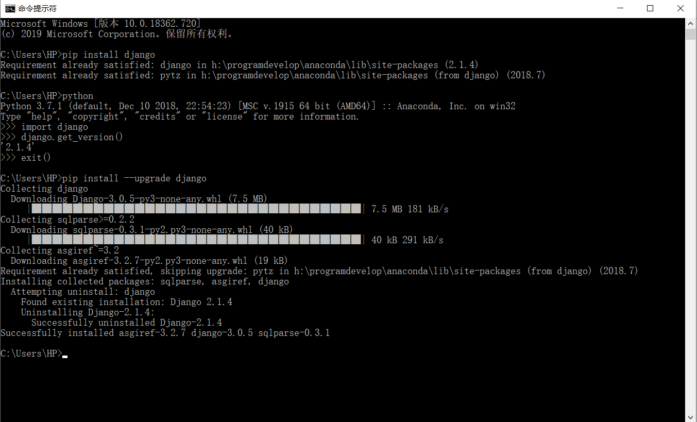

### Django学习笔记

### 网站参考
- [Django官网](https://www.djangoproject.com/)
- [Django中文网 2.0中文入门教程](https://www.django.cn/course/course-1.html)
- [Django 教程 菜鸟教程](https://www.runoob.com/django/django-tutorial.html)
- [Django 教程 W3CSchool](https://www.w3cschool.cn/django/)

### 其它参考
- 建议先看下Python_advanced_learning 中的:
    - 03_Python_network_programming--->005_MSGI_Mini_Web 框架项目，理解 web 框架的基本原理
    - MSGI_Mini_Web 框架实现了静态请求处理、动态请求处理、添加配置文件、添加路由功能、MySQL数据库查询等功能
    - [MSGI_Mini_Web 项目 GitHub 地址](https://github.com/FelixZFB/Python_advanced_learning/tree/master/03_Python_network_programming/005_MSGI_Mini_Web%E6%A1%86%E6%9E%B6)

# 1 Django 概述
## 1.1 为什么是 Django ?
- 使用Django，您可以在几个小时内将Web应用程序从概念转移到启动。
- Django负责Web开发的大部分麻烦，所以您可以专注于编写应用程序，而不需要重新发明方向盘。它是免费的，开源的。
- 速度快得离谱：Django的设计是为了帮助开发人员尽可能快地将应用程序从概念转移到完成。
- 功能丰富：Django包含了数十个可以用来处理常见Web开发任务的附加程序。Django负责用户身份验证、内容管理、站点地图、RSS提要和更多的任务--就在眼前。
- 安全可靠：Django非常重视安全性，并帮助开发人员避免许多常见的安全错误，例如SQL注入、跨站点脚本编写、跨站点请求伪造和点击劫持。它的用户认证系统为管理用户帐户和密码提供了一种安全的方法。
- 可扩展性：利用Django的能力，快速、灵活地扩展规模，以满足最大的使用需求。
- 适用性广：公司、组织和政府使用Django构建了各种各样的东西--从内容管理系统到社交网络，再到科学计算平台

## 1.2 Django 安装
- [Django官网](https://www.djangoproject.com/)
- Windows环境
    - Windows本地安装，直接CMD终端：
        - pip install django            自动拉取最新版
        - pip install django=3.0.5      安装指定版本
        - pip install --upgrade django  升级本地版本为最新版本
        - 由于我本地只安装了anaconda环境，没有安装其它python版本
        - pip直接安装都是安装在anaconda环境下的包里面
        
    - Ubuntu安装，安装方法类似
        - 先安装虚拟环境，新建一个虚拟环境，进入虚拟环境安装django和新建django项目
        - 参考Django框架教程新(HTML版_直接打开index查看)的1.1 1.2 
        - 以及 Django 教程网站的安装教程有详细说明
    - Pycharm安装(推荐使用该方法)
            - 方法1：进入虚拟环境后，安装pip安装
            - 方法2：直接pycharm里面包管理搜索安装
            - 添加pycharm源地址为国内镜像地址
            - 参考QQ浏览器收藏夹pycharm使用或[pycharm修改镜像源方法](https://blog.csdn.net/selfimpro_001/article/details/88670584)
            
            
- 注意：环境搭建
- Django安装和创建项目都在虚拟环境下面开始
        - 虚拟环境就是真实python环境的复制版
        - windows直接pycharm创建，然后CMD切换到Scripts下activate激活，就进入虚拟环境了
        - Ubuntu直接终端创建虚拟环境，创建后就自动进入虚拟环境了
        - Ubuntu具体步骤参考HTML版教程的 1.1 搭建环境。常用命令如下：
            - mkvirtualenv -p python3 py_django  创建python3下的虚拟环境名称py_django，-p参数用于指定python版本，默认是创建的python2
            - 工作在虚拟环境上，终端提示符最前面会出现"(虚拟环境名称)"。
            - 所有的虚拟环境，都位于/home/python/下的隐藏目录.virtualenvs下
            - deactivate                    退出虚拟环境
            - workon 两次tab键              查看所有虚拟环境
            - workon py_django              进入使用虚拟环境
            - rmvirtualenv py_django        删除虚拟环境，先退出：deactivate
            - pip install 包名称            虚拟环境中可以使用pip命令操作python包
            - pip list                      查看已安装的包
            - pip freeze                    查看已安装的包
            - 注意：在虚拟环境中不可使用sudo pip install 包名称 来安装python包，这样安装的包实际是安装在了真实的主机环境上。
        - virtualenv是如何创建“独立”的Python运行环境的呢？
            - 原理很简单，就是把系统Python复制一份到virtualenv的环境，
            - 用命令source venv/bin/activate进入一个virtualenv环境时，
            - virtualenv会修改相关环境变量，让命令python和pip均指向当前的virtualenv环境。
    
## 1.3 MVC    
- MVC框架的核心思想是：解耦，让不同的代码块之间降低耦合，增强代码的可扩展性和可移植性，实现向后兼容。
- 当前主流的开发语言如Java、PHP、Python中都有MVC框架 

- Web MVC各部分的功能
    - M全拼为Model，主要封装对数据库层的访问，对数据库中的数据进行增、删、改、查操作。
    - V全拼为View，用于封装结果，生成页面展示的html内容。
    - C全拼为Controller，用于接收请求，处理业务逻辑，与Model和View交互，返回结果。
    
    
     
## 1.4 Django 简介
- Django的主要目的是简便、快速的开发数据库驱动的网站。
    - 它强调代码复用，多个组件可以很方便的以"插件"形式服务于整个框架，
    - Django有许多功能强大的第三方插件，你甚至可以很方便的开发出自己的工具包。
    - 这使得Django具有很强的可扩展性。
    - 它还强调快速开发和DRY(Do Not Repeat Your self)原则。

- Django框架遵循MVC设计，并且有一个专有名词：MVT
    - MVT各部分的功能：
        - M全拼为Model，与MVC中的M功能相同，负责和数据库交互，进行数据处理。
        - V全拼为View，与MVC中的C功能相同，接收请求，进行业务处理，返回应答。
        - T全拼为Template，与MVC中的V功能相同，负责封装构造要返回的html。
        - 差异就在于黑线黑箭头标识出来的部分:
        
 
        
# 2 创建一个项目
## 2.1 创建 Django 项目
- 虚拟环境下，进入 01_StartProject 目录下执行创建项目命令：
    - django-admin startproject test1   
    - tree /f  查看文件夹 tree 树形结构
    
    - 项目各文件说明：
        - manage.py是项目管理文件，通过它管理项目。
        - 与项目同名的目录，此处为test1。
        - \_init_.py是一个空文件，作用是这个目录test1可以被当作包使用。
        - settings.py是项目的整体配置文件。
        - urls.py是项目的URL配置文件。
        - wsgi.py是项目与WSGI兼容的Web服务器入口，详细内容会在布署中讲到
        
## 2.2 创建应用
- 进入 test1 项目文件夹下创建应用，执行以下命令
    - python manage.py startapp booktest
    - tree /f  查看文件夹 tree 树形结构
    
    - 项目各文件说明：
        - \_init.py_是一个空文件，表示当前目录booktest可以当作一个python包使用。
        - tests.py文件用于开发测试用例，在实际开发中会有专门的测试人员，这个事情不需要我们来做。
        - models.py文件跟数据库操作相关。
        - views.py文件跟接收浏览器请求，进行处理，返回页面相关。
        - admin.py文件跟网站的后台管理相关。
        - migrations文件夹之后给大家介绍。

- 安装应用
    - 应用创建成功后，需要安装才可以使用，也就是建立应用和项目之间的关联，
    - 在test1/settings.py中INSTALLED_APPS下添加应用的名称就可以完成安装。
    - INSTALLED_APPS 列表元素末尾添加：'booktest',

- 开发服务器
    - 在开发阶段，为了能够快速预览到开发的效果，django提供了一个纯python编写的轻量级web服务器，仅在开发阶段使用。
    - 运行服务器命令如下,终端要切换到项目文件夹/test1下下执行：
        - python manage.py runserver ip:端口
        - python manage.py runserver
        - 可以不写IP和端口，默认IP是127.0.0.1，默认端口为8000。
        - 如果本地启动多个django服务器，可以指定不同的端口号，先进入各自项目的虚拟环境，然后切换到项目文件夹下，运行服务
        - python manage.py runserver 127.0.0.1:8000
        - python manage.py runserver 127.0.0.1:8001
        - python manage.py runserver 127.0.0.1:8002
        - 紧接着在浏览器中输入网址：127.0.0.1:8000，可以查看当前站点开发效果。
    - ctrl + c  退出服务器，按下后需要等待一小会儿才会停止服务器


# 3 Django 基本知识
- Django 项目整体说明，以第 2 节创建的 test1 为例
    - /test1/test1 里面是django项目整体配置
    - /test1/booktest 里面是应用的相关配置
    - db.sqlite3 是默认使用的数据库文件
    - manage.py 项目管理文件，通过它管理项目

## 3.1 设计模型 (models.py)
- ORM框架
    - O是object，也就类对象的意思，
    - R是relation，翻译成中文是关系，也就是关系数据库中数据表的意思，
    - M是mapping，是映射的意思。
    - 在ORM框架中，它帮我们把 类和数据表进行了一个映射，可以让我们通过类和类对象就能操作它所对应的表格中的数据。
    - ORM框架还有一个功能，它可以根据我们设计的类自动帮我们生成数据库中的表格，省去了我们自己建表的过程。
    

- django中内嵌了ORM框架，不需要直接面向数据库编程，而是定义模型类，通过模型类和对象完成数据表的增删改查操作。
    - 使用django进行数据库开发的步骤如下：
    - 1.在models.py中定义模型类
    - 2.迁移
    - 3.通过类和对象完成数据增删改查操作

- 通过模型类进行MySQL数据库的增删改查，面向数据库编程转变成面向对象编程
    - 实际底部是面向对象增删改查通过django的ORM框架转换为mysql语句
     
## 3.2 模型类实例 (models.py)
- 注意：所有命令要终端要切换到项目文件夹/test1下下执行
    - 虚拟环境项目文件夹路径如下：
    - (venv) D:\PyProject\Django_2020\01_StartProject\test1> 
- 1.定义模型类
        - 模型类定义在/booktest/models.py文件中，继承自models.Model类。
- 2.迁移由两步完成: 
    - 注意：ctrl + c 退出服务器模式，虚拟环境下执行命令
    - 2.1.生成迁移文件：根据模型类生成创建表的迁移文件。
        - python manage.py makemigrations
        - 生成的迁移文件位置：/booktest/migrations/0001_initial.py
        - Django框架根据我们设计的模型类生成了迁移文件，
        - 在迁移文件中我们可以看到fields列表中每一个元素跟BookInfo类属性名以及属性的类型是一致的。
        - 同时我们发现多了一个id项，这一项是Django框架帮我们自动生成的，
        - 在创建表的时候id就会作为对应表的主键列，并且主键列自动增长。
        
    - 2.2.执行迁移：根据第一步生成的迁移文件在数据库中创建表。
        - python manage.py migrate
        - 生成的数据表文件位置：/test1/db.sqlite3
        - Django默认采用sqlite3数据库
        - 生成的数据表的默认名称为：
            - <app_name>_<model_name>
            - booktest_bookinfo
    - 上面执行结果如下：
    
    
- sqlite3数据库可视化操作：
    - sqlite3是一个轻量化的数据库，口语直接使用Navicat Premium软件打开文件操作
    - Navicat Premium--->文件--->新建连接--->Sqlite--->写上连接名--->现有数据库文件--->选择本地的sqlite3文件确定即可
    - 就可以打开查看操作数据库了
    
      
- 3.数据操作
    - 成数据表的迁移之后，下面就可以通过进入项目的shell，进行简单的API操作。
    - 如果需要退出项目，可以使用ctrl+d快捷键或输入quit()。
    - 进入项目shell的命令：
        - python manage.py shell
        - from booktest.models import BookInfo,HeroInfo  首先引入booktest/models中的类
        - BookInfo.objects.all()  查询所有图书信息
    
    - 第一次写入数据错误记录
        - 错误提示：django.db.utils.OperationalError: table booktest_bookinfo has no column named bpub_date
        - 错误原因：1 中定义模型将bpub_date写成bpub_title了，可以查看008图片
        - 错误解决：先修改模型中定义名称，然后重新生成迁移文件和执行迁移
        
    
    - 写入数据：
        - 进入shell终端后就可以，写入数据了，写入后记得保存
        - BookInfo.objects.all()  查看数据
        - 保存后，再次写入(实际是修改，因为用的是同一个实例对象)，然后保存，会直接覆盖之前的数据，参考下图
        
        - 注意：写入数据和查询数据都需要先创建一个实例对象
            - 写入数据时，创建类的实例对象：b=BookInfo()
            - 查询数据时，创建指定的实例对象，指定id值：b=BookInfo.objects.get(id=1)
    
    - 查询，修改，删除数据：
        - 注意：始终用同一个实例对象，就可以对该对象进行多个操作
        - 和写入时候一样，查询属性的值
        - 创建查询对象：b=BookInfo.objects.get(id=1) (注意：该处对象名称可以不用b,可以写成b1,避免混淆)
            - b.title
            - b.pub_date
        - 修改后需要执行保存命令：b.save
        - 删除数据：b.delete()
        - 具体参考下图，依次是查询-修改-删除
        
        
- 4.添加一个新的模型类，英雄类
    - models.py添加英雄类，注意设置外键时候django1.8版本以后需要on_delete参数，不然会报以下错误
        - __init__() missing 1 required positional argument: 'on_delete'
        - 生成迁移文件错误，可以直接删除migrations下面的0001和0002文件和db.sqlite3文件，然后重新执行生成文件和执行迁移命令
        - 详细参考以下两篇博文：
            - https://www.cnblogs.com/phyger/p/8035253.html
            - https://www.cnblogs.com/cpl9412290130/p/9608331.html
    - 分别执行生成迁移文件，执行迁移命令:
        - python manage.py makemigrations
        - python manage.py migrate
     
    - 图书与英雄是一对多的关系，django中提供了关联的操作方式。
        - 获得关联集合：返回当前book对象的所有hero
        - b.heroinfo_set.all()
        - 一（图书对象）对多（英雄名称类小写加上下划线和set）
- 5.操作补充：
    - 查询图书表里面的所有内容。
	    - BookInfo.objects.all()
	    - HeroInfo.objects.all()
	- 查询出id为2的图书中所有英雄人物的信息。
	    - 第一步，创建图书的对象：b = BookInfo.objects.get(id=2)
	    - 第二步，查询所有关联的英雄对象：b.heroinfo_set.all() #查询出b图书中所有英雄人物的信息


## 3.3 后台管理 (admin.py)
- Django能够根据定义的模型类自动地生成管理页面。
- 使用Django的管理模块，需要按照如下步骤操作：
    - 具体步骤查看Django框架教程HTML版 1.4 节
    - 1.管理界面本地化
        - 本地化是将显示的语言、时间等使用本地的习惯，
        - 这里的本地化就是进行中国化，中国大陆地区使用简体中文，时区使用亚洲/上海时区
        - 语言和时区的本地化。
        - 修改项目的settings.py文件(/test1/settings.py) 
    - 2.创建管理员
        - 创建管理员的命令如下，按提示输入用户名、邮箱、密码
        - 用户名：admin  邮箱和密码自定义设置（182...@qq.com, z1z)
        - 命令：python manage.py createsuperuser
        - 接下来启动服务器：python manage.py runserver （退出服务器 ctrl + c）
        - 打开浏览器，在地址栏中输入如下地址后回车：http://127.0.0.1:8000/admin/
        - 输入前面创建的用户名、密码完成登录
    - 3.注册模型类
        - 登录后台管理后，默认没有我们创建的应用中定义的模型类，
        - 需要在自己应用中的admin.py文件中注册，才可以在后台管理中看到，并进行增删改查操作
        - 默认没有我们创建的应用中定义的模型类，需要在自己应用中的booktest/admin.py文件中注册，才可以在后台管理中看到，并进行增删改查操作
    - 4.自定义管理页面
        - 自定义模型管理类。模型管理类就是告诉django在生成的管理页面上显示哪些内容
        - 列表页只显示出了BookInfo object，对象的其它属性并没有列出来，查看非常不方便。
        - Django提供了自定义管理页面的功能，比如列表页要显示哪些值。
        - 打开booktest/admin.py文件，自定义类，继承自admin.ModelAdmin类
        - 详细说明查看admin.py文件及其注释
    - 注意：
        - 后台管理默认显示的是
            - Bookinfo object(1)  
            - Bookinfo object(2)
        - 该名称是有/booktest/models.py中的__str__方法决定的
        - 我们可以修改该方法，让后台显示对象的名称，查看models.py
        - 注意：admin.py中设置对象展示方式后该方法自动忽略


## 3.4 视图 (views.py) 
- 访问http://127.0.0.1:8000/admin/ 进入后台管理界面
- 服务器在收到这个请求之后，就一定对应着一个处理动作，这个处理动作就是帮我们产生页面内容并返回回来，这个过程是由视图来做的

- 对于django的设计框架MVT，用户在URL中请求的是视图，视图接收请求后进行处理，并将处理的结果返回给请求者

- 视图时需要进行两步操作：
    - 1.定义视图函数
        - 视图就是一个Python函数，被定义在views.py中
        - 视图的必须有一个参数，一般叫request，视图必须返回HttpResponse对象，HttpResponse中的参数内容会显示在浏览器的页面上。
        - 具体查看：booktest/views.py
    - 2.配置URLconf
        - 查找视图的过程：
            - 请求者在浏览器地址栏中输入url，请求到网站后，获取url信息，然后与编写好的URLconf逐条匹配，
            - 如果匹配成功则调用对应的视图函数，如果所有的URLconf都没有匹配成功，则返回404错误。
        - 一条URLconf包括url规则、视图两部分：
            - url规则使用正则表达式定义。
            - 视图就是在views.py中定义的视图函数。
        - 需要两步完成URLconf配置：
            - 1.在应用中定义URLconf，具体查看：booktest/urls.py
            - 2.包含到项目的URLconf中，应用中的urls.py需要自己新建，具体查看：test1/urls.py
        - 注意点：
            - urls文件，django2.0以前路径是使用的url，后面版本都使用path
            - 正则表达式需要严格匹配url地址的开头和结尾
     
     


## 3.5 模板 (templates) 
- 如何向请求者返回一个漂亮的页面呢？
    - 肯定需要用到html、css，如果想要更炫的效果还要加入js，问题来了，
    - 这么一堆字段串全都写到视图中，作为HttpResponse()的参数吗？这样定义就太麻烦了吧
    - 在Django中，将前端的内容定义在模板中，然后再把模板交给视图调用，各种漂亮、炫酷的效果就出现了

- 创建模板文件
    - 项目目录下创建模板文件夹：templates
    - 每个应用单独在模板下面创建一个应用同名的文件夹：booktest
    - 应用文件夹里面创建具体的模板文件，比如：index.html
    - 结构就是：test1/templates/booktest/index.html
    - 注意，settings.py 里面需要设置模板文件夹的路径

- 定义模板文件
    - templtes/booktest/index.html文件
    - 在模板中输出变量语法如下，变量可能是从视图中传递过来的，也可能是在模板中定义的
        - {{变量名}}
        - {{title}}
    - 在模板中编写代码段语法如下：
        - 
        - 
        - {{i}}<br>
        - 
        - 注意使用for循环代码后，末尾要写上结束代码
    - 具体查看index.html文件和views.py视图文件
    
- 视图调用模板
    - 1.找到模板
    - 2.定义上下文 context
    - 3.渲染模板 render
    - 具体查看views.py视图文件中index函数里面的方式2，使用模板文件
     
    
    
## 3.6 简单的综合实例
- 目标：请求一个网址，连接数据库，取出数据，展示在浏览器中
    - 请求该网址：http://127.0.0.1:8000/show_books
    - 浏览器展示所有的图书信息，
    - 请求该网址：http://127.0.0.1:8000/books/1
    - 浏览器显示图书信息以及包含的英雄信息
    - M全拼为Model: 模型，连接数据库，取出数据
    - V全拼为View：视图，接收request请求，进行业务处理，返回response。
    - T全拼为Template：模板，负责封装构造要返回的html。

- 具体步骤：
    - MVT完成包括三个方面，三个方面顺序不分先后:
    - 1.定义模型models.py
    - 2.定义视图views.py
        - show_books函数：查询数据库，返回所有图书信息，然后调用模板，然后展示出来
        - detail函数：
            - 点击图书连接,连接里面包含图书的id，展示图书及英雄信息。
            - 图书id作为参数传给detail函数，然后获取图书关联的英雄信息
            - 返回信息，调用模板，然后展示出来
            - 正则表达式中的分组会自动作为参数传给视图中的函数
        - 定义URLconf, 应用booktest下的urls，项目test1下的urls上面3.4节中已经配置了
    - 3.定义模板文件，主要是html文件

- 运行：
    - 启动服务器：python manage.py runserver
    - http://127.0.0.1:8000/show_books
    - 点击图书进入详情页：
        - http://127.0.0.1:8000/books/1
        - http://127.0.0.1:8000/books/2

# 4 Django 使用 MySQL 数据库实例
## 4.1 Django 中的 ORM
- ORM，全拼Object-Relation Mapping，中文意为对象-关系映射，是随着面向对象的软件开发方法发展而产生的。
- 在MVC框架中的Model模块中都包括ORM，对于开发人员主要带来了如下好处：
    - 实现了数据模型与数据库的解耦，通过简单的配置就可以轻松更换数据库，而不需要修改代码。
    - 只需要面向对象编程，不需要面向数据库编写代码。
    - 在MVC中Model中定义的类，通过ORM与关系型数据库中的表对应，对象的属性体现对象间的关系，这种关系也被映射到数据表中。

- Django框架中ORM示意图如下:
 

## 4.2 Django 配置 MySQL 数据库
- Django默认使用的是sqlite3轻量化数据库，以项目test2为例
- Django配置使用MySQL数据库

- 1.创建项目test2
    - 在/Django_2020/01_StartProject目录下创建项目test2 (里面已有第 3 章创建的 test1 项目)
    - 激活进入Django_2020项目虚拟环境，切换到01_StartProject文件夹下创建项目：
    - 执行命令：django-admin startproject test2
    - 项目结构如下：
        ```
        - test2
            - manage.py
            │
            └─test2
                asgi.py
                settings.py
                urls.py
                wsgi.py
                __init__.py
        ```
- 2.test2项目下创建应用booktest
    - 切换到test2目录下，执行命令：
    - python manage.py startapp booktest
    - 注册应用，/test2/settings.py中的INSTALLED_APPS列表末尾添加
    - 'booktest', # 注册自定义的应用，注意逗号写上
    
- 3.数据库配置，使用mysql数据库
    - DATABASE配置mysql数据库：
        - 将引擎改为mysql，提供连接的主机HOST、端口PORT、数据库名NAME、用户名USER、密码PASSWORD
        - 修改/test2/settings.py中的DATABASES，将默认的sqlite3的两行代码注释掉，具体设置如下：
        - 先本地进入mysql数据库，创建一个django_test2作为本项目使用的数据库
        - 创建命令：create database django_test2 charset=utf8;
        - 注意：数据库 Django框架不会自动生成，需要我们自己进入mysql数据库去创建，使用上面命令
            ```python
            DATABASES = {
                'default': {
                    # 'ENGINE': 'django.db.backends.sqlite3',
                    # 'NAME': os.path.join(BASE_DIR, 'db.sqlite3'),
                    'ENGINE': 'django.db.backends.mysql', #使用mysql数据库
                    'NAME': 'django_test2', #使用的数据库database的名字，已经提取创建好
                    'USER': 'root', #数据库登录用户名，默认就是root
                    'PASSWORD': '00116656', #数据库登录密码,数据库安装时候设置的用户密码
                    'HOST': 'localhost', #数据库所在主机的IP地址，本机直接用localhost
                    'PORT': '3306', #数据库端口，默认就是3306
                }
            }
            ```    
    - 安装pymysql包，配置pymysql：
        - 安装pymysql包，用于python连接操作mysql数据库
        - 虚拟环境下执行：pip install pymysql
        - /test2/\__init\__.py文件中配置pymsql，加入以下两句代码：
            - import pymysql
            - pymysql.install_as_MySQLdb()
        
- 4. 启动服务器：
- 运行：
    - 启动服务器：python manage.py runserver
    - http://127.0.0.1:8000
    
- 版本兼容性问题：
    - 注意上面mysql配置对于django2.2之前版本没有问题，但是2.2之后会报错：
    - ImproperlyConfigured: mysqlclient 1.3.13 or newer is required
    - 解决方法：
        - 卸载pymysql包：pip uninstall pymysql
        - 注释掉/test2/\__init\__.py中添加的两行代码
        - 安装mysqlclient包：pip install mysqlclient
        - django 2.2以后都是使用mysqlclient包了
        - 具体参考该博文：
        - [django 2.2与mysql兼容性问题](https://blog.csdn.net/lpw_cn/article/details/103978909)
         
         
    - pymysql和mysqlclient操作mysql数据库区别：
        - 导入的包不同
        - mysqlclient创建连接比pymysql前面多加一个MySQLdb
        - 就是创建连接时候有点区别，其它操作都一样
        - 具体参考下图：
         
        - 博文参考：[通过mysqlclient操作MySQL数据库]()

- 上面步骤都成功后，django配置mysql数据库完成。
       
## 4.3 设计模型
- /booktest/model.py自定义模型，具体查看模型文件
- 生成迁移文件和执行迁移命令，让其在mysql数据库中生成和模型内相应的数据表
    - python manage.py makemigrations
    - python manage.py migrate
    
## 4.4 启动查看数据库
- 打开一个终端，启动本地mysql数据库
    - 使用dango_test2数据库文件：use dango_test2; 
    - 查看是否有自定义的模型对应的数据表：show tables;
    - 查看数据表详细信息：
        - desc booktest_bookinfo;
        - desc booktest_heroinfo;
         
        
## 4.5 数据库操作
- mysql终端插入数据，然后进django后台查看
- 后台管理，参考3.3节，修改test2/settings.py和booktest/admin.py
    - 1.本地化设置
    - 2.创建管理员
    - 3.注册模型
    - 4.自定义展示后台内容
- 启动django服务器进入后台
    - python manage.py runserver
    - http://127.0.0.1:8000/admin
     
    
## 4.6 项目 MVT 配置
- M模型4.3已经完成
    - 编写/booktest/models.py文件

- V视图(参考3.4节)
    - 定义视图函数: /booktst/views.py
    - 配置URLconf(应用和项目下的urls.py): 
        - /booktst/urls.py
        - /test2/urls.py
    - from booktest import views 导入时候注意问题：
        - 此处导入注意，由于test1和test2项目文件都标记为了source root
        - 此处搜索booktest时候开始按循序先搜到了test1文件中的，然后导入的views就是test1中的
        - 解决方法，不同项目尽量不要使用相同的名称，可以避免
        - 折中方法：先取消test1文件夹标记，test2标记，test1标记时候取消test2标记

- T模板(参考3.5节)
    - 创建模板文件: /templates/booktest/
        - index.html
        - detail.html
    - 配置模板文件路径: /test2/settings.py 中设置

- 服务器运行状态，访问
    - http://127.0.0.1:8000/index    图书列表首页
    - http://127.0.0.1:8000/books/1  或者2或者3图书详情页
    - 图书列表展示_图书详情展示_新增图书_删除图书执行效果如下：
         
  

## 5 模型(M)深入
## 5.1 定义属性
- Django根据属性的类型确定以下信息：
    - 当前选择的数据库支持字段的类型
    - 渲染管理表单时使用的默认html控件
    - 在管理站点最低限度的验证

- django会为表创建自动增长的主键列，每个模型只能有一个主键列，如果使用选项设置某属性为主键列后django不会再创建自动增长的主键列    
- 默认创建的主键列属性为id，可以使用pk代替，pk全拼为primary key。
    - 注意：pk是主键的别名，若主键名为id2，那么pk是id2的别名。

- 属性命名限制：
    - 不能是python的保留关键字。
    - 不允许使用连续的下划线(间断的单下划线可以)，这是由django的查询方式决定的，在第4节会详细讲解查询。
    - 定义属性时需要指定字段类型，通过字段类型的参数指定选项，语法如下：

- 属性 = models.字段类型(选项)
    - 比如以下模型属性：
        - hname = models.CharField(max_length=20)
        - hgender = models.BooleanField()
        - bpub_date = models.DateField()

## 5.2 字段类型
- 属性 = models.字段类型(选项)
- 使用时需要引入django.db.models包，字段类型如下：
    - 常用类型：
    - BooleanField：布尔字段，值为True或False。用于性别。
    - CharField(max_length=字符长度)：字符串。
        - 参数max_length表示最大字符个数。
        - 必须有长度参数
    - IntegerField：整数。
    - DateField[auto_now=False, auto_now_add=False])：日期(年月日)。
        - 参数auto_now表示每次保存对象时，自动设置该字段为当前时间，用于"最后一次修改"的时间戳，它总是使用当前日期，默认为false。
            - auto_now=True，表示属性的值使用更新的时间，自动修改为更新的时间
        - 参数auto_now_add表示当对象第一次被创建时自动设置当前时间，用于创建的时间戳，它总是使用当前日期，默认为false。
            - auto_now_add=True 表示属性的值使用创建的时间
        - 参数auto_now_add和auto_now是相互排斥的，组合将会发生错误。
        - 一般不用指定参数，两个要指定True时候只能指定一个，不然会产生冲突。
        - 频繁修改情况可以使用auto_now=True
    - TimeField：时间(时分秒)，参数同DateField。
    - DateTimeField：日期时间(年月日时分秒)，参数同DateField。  
    - FileField：上传文件字段。
    - ImageField：继承于FileField，对上传的内容进行校验，确保是有效的图片。
    - DecimalField(max_digits=None, decimal_places=None)：十进制浮点数。
        - 参数max_digits表示总位数。
        - 参数decimal_places表示小数位数。
        - 用于表示价格等精准数字
    - FloatField：浮点数。
        - 常用数字，参数同上  
        
    - 不常用类型：
    - AutoField：自动增长的IntegerField，通常不用指定，不指定时Django会自动创建属性名为id的自动增长属性。
    - NullBooleanField：支持Null、True、False三种值。
    - TextField：大文本字段，一般超过4000个字符时使用。
        
## 5.3 选项
- 属性 = models.字段类型(选项)
- 通过选项实现对字段的约束，选项如下：
    - null：如果为True，表示允许为空，默认值是False。
    - blank：如果为True，则该字段允许为空白，默认值是False。
        - 用于Django后台管理，添加内容时候某个属性设置为blank时候，后台表单选择时候可以不写内容。
        - 对比：null是数据库范畴的概念，blank是表单验证范畴的。
    - db_column：字段的名称（相当于给属性的数据库中重命名），如果未指定，则使用属性的名称。一般不指定。
    - db_index：若值为True, 则在表中会为此字段创建索引，默认值是False。
    - default：默认值。
    - primary_key：若为True，则该字段会成为模型的主键字段，默认值是False，一般作为AutoField的选项使用。
    - unique：如果为True, 这个字段在表中必须有唯一值，默认值是False。
    - 注意：选项如果修改后，需要重新生成迁移文件并执行迁移命令

- 使用示例：
```python
from django.db import models

#定义图书模型类BookInfo
class BookInfo(models.Model):
    #btitle = models.CharField(max_length=20)#图书名称
    btitle = models.CharField(max_length=20, db_column='title')#通过db_column指定btitle对应表格中字段的名字为title
    bpub_date = models.DateField()#发布日期
    bread = models.IntegerField(default=0)#阅读量
    bcomment = models.IntegerField(default=0)#评论量
    isDelete = models.BooleanField(default=False)#逻辑删除

#定义英雄模型类HeroInfo
class HeroInfo(models.Model):
    hname = models.CharField(max_length=20)#英雄姓名
    hgender = models.BooleanField(default=True)#英雄性别
    isDelete = models.BooleanField(default=False)#逻辑删除
    #hcomment = models.CharField(max_length=200)#英雄描述信息
    hcomment = models.CharField(max_length=200, null=True, blank=False) #hcomment对应的数据库中的字段可以为空，但通过后台管理页面添加英雄信息时hcomment对应的输入框不能为空
    hbook = models.ForeignKey('BookInfo')#英雄与图书表的关系为一对多，所以属性定义在英雄模型类中
```   

## 5.4 字段查询
- M(Model)模型实现sql中where语句的功能，调用过滤器filter()、exclude()、get()，下面以filter()为例。
- 通过"属性名_id"表示外键对应对象的id值。
- 语法如下：
    - 属性名称__比较运算符=值
    - list=BookInfo.objects.filter(id=1)
    - SQL语法如下：
        - select * from 表名 where 条件;
        - select * from students where id=1;
    - 说明：属性名称和比较运算符间使用两个下划线，所以前面定义属性名称时候不能包括多个下划线。
    - id__exact=1
    - id=1 （exact表示判等，可以简写）
    - btitle__contains='传'
    - btitle__endswith='部'

- Django查询步骤：
    - 激活虚拟环境，切换到项目文件夹下，现有以test2为例，切换到/01_StartProject/test2下
    - 运行django调试端：python manage.py shell
    - 导入模型类，查询一个模型实例对象，然后就可以通过实例直接查看相关属性的值
    ```
    >>> from booktest.models import BookInfo
    >>> b = BookInfo.objects.get(id=1)
    >>> print(b)
    BookInfo object (1)
    >>> print(b.btitle)
    射雕英雄传
    >>> books = BookInfo.objects.all()
    >>> type(books)
    <class 'django.db.models.query.QuerySet'>
    >>> print(books)
    <QuerySet [<BookInfo: BookInfo object (1)>, <BookInfo: BookInfo object (2)>, <BookInfo: BookInfo object (3)>, <BookInfo: BookInfo object (4)>, <BookInfo: BookInfo object (7)>, <BookInfo: BookInfo object (11)>, <BookInfo: BookInfo object (12)>, <BookInfo: BookInfo object (13)>]>
    >>> b1 = BookInfo.objects.filter(btitle__contains='传')
    >>> print(b1)
    <QuerySet [<BookInfo: BookInfo object (1)>]>
    >>> print(b1.btitle)
    Traceback (most recent call last):
      File "<console>", line 1, in <module>
    AttributeError: 'QuerySet' object has no attribute 'btitle'
    >>> type(b1)
    <class 'django.db.models.query.QuerySet'>
    >>>  
    ```
    - 如果查询的对象不存在，会报出DoesNotExist的错误

## 5.5 查询函数
- get	
    - 返回表中满足条件的一条且只能有一条数据。	
    - 返回值是一个模型类对象。可以直接用句点法查看对象属性
    - 参数中写查询条件。
        - 1)如果查到多条数据，则抛异常MultipleObjectsReturned。
        - 2)查询不到数据，则抛异常：DoesNotExist。
- all	
    - 返回模型类对应表格中的所有数据。	
    - 返回值是QuerySet类型，查询集。集合类型。
    - 参数写查询条件。
    - 查询表的all，all可以省略
        - list = BookInfo.objects.count()
        - list = BookInfo.objects.all().count()
        - print(list)
        - 8
- filter(最常用)	
    - 返回满足条件的数据。	
    - 返回值是QuerySet类型，查询集。
    - 参数写查询条件。
- exclude	
    - 返回不满足条件的数据。	
    - 返回值是QuerySet类型，查询集。
    - 参数写查询条件。
- order_by	
    - 对查询结果进行排序。	
    - 返回值是QuerySet类型，查询集。
    - 参数中写根据哪些字段进行排序。
    - 默认升序，

## 5.6 条件查询(属性和常量比较)
- 1) 查询等
    - exact：表示判等。
    - 例：查询编号为1的图书。
    - list=BookInfo.objects.filter(id__exact=1)
    - 可简写为：
    - list=BookInfo.objects.filter(id=1)
    - 结果是一个QuerySet集合类型，list只是为了方便，并不是列表，而是一个集合列表
    - 查看上面Django查询步骤里面的查询结果

- 2) 模糊查询
    - contains：是否包含。
    - 说明：如果要包含%无需转义，直接写即可。
    - 例：查询书名包含'传'的图书。
    - list = BookInfo.objects.filter(btitle__contains='传')
    - startswith、endswith：以指定值开头或结尾。
    - 例：查询书名以'部'结尾的图书
    - list = BookInfo.objects.filter(btitle__endswith='部')
    - 以上运算符都区分大小写，在这些运算符前加上i表示不区分大小写，如iexact、icontains、istartswith、iendswith.

- 3) 空查询
    - isnull：是否为null。
    - 例：查询书名不为空的图书。
    - list = BookInfo.objects.filter(btitle__isnull=False)
    - 等同于SQL语句：
    - select * from booktest_bookinfo where btitle is not null;

- 4) 范围查询
    - in：是否包含在范围内。
    - 例：查询编号为1或3或5的图书
    - list = BookInfo.objects.filter(id__in=[1, 3, 5])

- 5) 比较查询
    - gt、gte、lt、lte：大于、大于等于、小于、小于等于。
    - 例：查询编号大于3的图书
    - list = BookInfo.objects.filter(id__gt=3)
    - 不等于的运算符，使用exclude()过滤器。
    - 例：查询编号不等于3的图书
    - list = BookInfo.objects.exclude(id=3)

- 6) 日期查询
    - year、month、day、week_day、hour、minute、second：对日期时间类型的属性进行运算。
    - 例：查询1980年发表的图书。
    - list = BookInfo.objects.filter(bpub_date__year=1980)
    - 例：查询1980年1月1日后发表的图书。
    - list = BookInfo.objects.filter(bpub_date__gt=date(1990, 1, 1))

## 5.7 F对象查询(类属性之间比较)
- F对象：之前的查询都是对象的属性与常量值比较，两个属性的值怎么比较呢？
- 答：使用F对象，被定义在django.db.models中。
- 语法如下：
    - F(属性名)
- 例：查询阅读量大于等于评论量的图书。
    - from django.db.models import F
    - list = BookInfo.objects.filter(bread__gte=F('bcomment'))
    - 可以在F对象上使用算数运算。
    - 例：查询阅读量大于2倍评论量的图书。
    - list = BookInfo.objects.filter(bread__gt=F('bcomment') * 2)
- 注意：
    - 使用前要先导入F对象

## 5.8 Q对象查询(多个条件查询)
- 多个过滤器逐个调用表示逻辑与关系，同sql语句中where部分的and关键字。
- 例：查询阅读量大于20，并且编号小于3的图书。
    - list=BookInfo.objects.filter(bread__gt=20,id__lt=3)
    - 或list=BookInfo.objects.filter(bread__gt=20).filter(id__lt=3)
- 如果需要实现逻辑或or的查询，必须使用Q()对象结合|运算符，Q对象被义在django.db.models中。
    - 语法如下：
    - Q(属性名__运算符=值)
    - 例：查询阅读量大于20的图书，改写为Q对象如下。
        - from django.db.models import Q
        - list = BookInfo.objects.filter(Q(bread__gt=20))
- Q对象可以使用&、|连接，&表示逻辑与，|表示逻辑或。
    - 例：查询阅读量大于20，或编号小于3的图书，只能使用Q对象实现
        - list = BookInfo.objects.filter(Q(bread__gt=20) | Q(pk__lt=3))
    - Q对象前可以使用~操作符，表示非not。
    - 例：查询编号不等于3的图书。
        - list = BookInfo.objects.filter(~Q(pk=3))
- 注意：
    - 使用时候需要先导入Q对象
    - 查询与，直接使用上面的传多个参数，写法更简洁，或的话就需要使用Q对象  
    ```
    >>> b2 = BookInfo.objects.filter(bread__gt=20).filter(id__lt=3)
    >>> print(b2)
    <QuerySet [<BookInfo: BookInfo object (2)>]>
    >>> b3 = BookInfo.objects.filter(Q(bread__gt=20) | Q(pk__lt=3))
    Traceback (most recent call last):
      File "<console>", line 1, in <module>
    NameError: name 'Q' is not defined
    >>> from django.db.models import Q
    >>> b3 = BookInfo.objects.filter(Q(bread__gt=20) | Q(pk__lt=3))
    >>> print(b3)
    <QuerySet [<BookInfo: BookInfo object (1)>, <BookInfo: BookInfo object (2)>, <BookInfo: BookInfo object (4)>]>
    >>>
    ```

## 5.9 aggregate()聚合函数(返回函数的值)
- 使用aggregate()过滤器调用聚合函数。聚合函数包括：Avg，Count，Max，Min，Sum，被定义在django.db.models中。
    - 例：查询所有图书的总阅读量。
        - from django.db.models import Sum
        - list = BookInfo.objects.aggregate(Sum('bread'))
    - 注意aggregate的返回值是一个字典类型，格式如下：
        - {'聚合类小写__属性名':值}
        - 如:{'sum__bread':3}

- 使用count时一般不使用aggregate()过滤器。
    - 例：查询图书总数。
        - BookInfo.objects.all().count()
        - BookInfo.objects.count()
    - 例：统计id大于等于3的所有图书的数量
        - BooInfo.objects.filter(id__gt=3).count()
        - 先条件查询得到查询集，然后统计查询集中对象的数量
    - 注意count函数的返回值是一个数字。

## 5.10 查询集
- 前面将的查询可以一次性导入所有：    
    - from django.db.models import F,Q,Sum,Count,Avg,Max,Min
    - 查询返回结果是一个QuerySet查询集对象，就可以继续调用上面所有的查询函数，在结果里面继续查询

- 查询集是什么？    
    - 查询集表示从数据库中获取的对象集合，在管理器上调用某些过滤器方法会返回查询集，
    - 查询集可以含有零个、一个或多个过滤器。过滤器基于所给的参数限制查询的结果，
    - 从Sql的角度，查询集和select语句等价，过滤器像where和limit子句。
    - 例：查询编号大于3的图书
    - list = BookInfo.objects.filter(id__gt=3) 
    - 查询结果list就是一个QuerySet查询集

- 返回查询集的过滤器如下：
    - all()：返回所有数据。
    - filter()：返回满足条件的数据。
    - exclude()：返回满足条件之外的数据，相当于sql语句中where部分的not关键字。
    - order_by()：对结果进行排序。

- 返回单个值的过滤器如下：
    - get()：返回单个满足条件的对象
        - 如果未找到会引发"模型类.DoesNotExist"异常。
        - 如果多条被返回，会引发"模型类.MultipleObjectsReturned"异常。
    - count()：返回当前查询结果的总条数，结果是一个数字
    - aggregate()：聚合，返回一个字典。

- 判断某一个查询集中是否有数据：
    - exists()：判断查询集中是否有数据，如果有则返回True，没有则返回False。
    - 例：查询编号大于3的图书
    - list = BookInfo.objects.filter(id__gt=3)  
    - list.exists()
    - True 有数据  
    
- 查询集两大特性
    - 惰性执行：创建查询集不会访问数据库，直到调用数据时，才会访问数据库，调用数据的情况包括迭代、序列化、与if合用。
    - 缓存：使用同一个查询集，第一次使用时会发生数据库的查询，然后把结果缓存下来，再次使用这个查询集时会使用缓存的数据。
        - 例：
        - 惰性执行：
            - list = BookInfo.objects.filter(id__gt=3)
            - 返回查询集list, 并没有访问mysql数据库，只是相当于创建了一条sql查询语句
            - list
            - 调用查询集对象，此时访问数据库，返回查询结果
            - [<BookInfo: BookInfo object (3)>, <BookInfo: BookInfo object (4)>, <BookInfo: BookInfo object (7)>]
        - 缓存：
            - [x fox x in list]
            - [<BookInfo: BookInfo object (3)>, <BookInfo: BookInfo object (4)>, <BookInfo: BookInfo object (7)>]
            - 上面第一次调用for循环，会发生数据库查询
            - 再次调用for循环，直接取出缓存中的结果，不访问数据库

- 限制查询集
    - 查询集可以进行类似列表切片操作，可以对查询集进行取下标或切片操作
        - list = BookInfo.objects.filter(id__gt=3)
        - list1 = list[0:3]
    - 注意：
        - 下标和切片操作不能使用负值
        - 对查询集进行切片后返回一个新的查询集，不会立即执行查询
    - 使用负索引：   
        - list2 = list[0:-2] 会报错
    - 取出查询集的第一个数据,下面两种方式：
        - list[0]
        - list[0:1].get()
        - 但是如果没有数据，[0]引发IndexError异常，[0:1].get()如果没有数据引发DoesNotExist异常。

- 查询集的缓存 
    - 每个查询集都包含一个缓存来最小化对数据库的访问。
    - 在新建的查询集中，缓存为空，首次对查询集求值时，会发生数据库查询，
    - django会将查询的结果存在查询集的缓存中，并返回请求的结果，接下来对查询集求值将重用缓存中的结果          
    
    - 情况一：如下是两个查询集，无法重用缓存，每次查询都会与数据库进行一次交互，增加了数据库的负载。
        - from booktest.models import BookInfo
        - [book.id for book in BookInfo.objects.all()]
        - [book.id for book in BookInfo.objects.all()]
    - 情况二：经过存储后，可以重用查询集，第二次使用缓存中的数据。
        - list=BookInfo.objects.all()
        - [book.id for book in list]
        - [book.id for book in list]
    - 推荐使用方式2，先返回一个查询集对象，然后再继续操作查询集

## 5.11 模型类关系
- 关系字段类型
    - 关系型数据库的关系包括三种类型：
    - ForeignKey：一对多，将字段定义在多的一端中。
        - 比如一本图书有多个英雄，字段定义在英雄类里面。
    - ManyToManyField：多对多，将字段定义在任意一端中。
        - 一个新闻类和新闻类型类，一个新闻类型下可以用很多条新闻，一条新闻也可能归属于多种新闻类型。
    - OneToOneField：一对一，将字段定义在任意一端中。
        - 员工基本信息类（姓名）-员工详细信息类(住址，员工工号，岗位等等）
    - 可以维护递归的关联关系，使用'self'指定，详见"自关联"。
    - 注意：关系型字段

- 一对多关联（常用，重点）：
    - 一个英雄即属于英雄类，又属于图书类
    - 一对多使用ForeignKey，定义在英雄类中
    - hbook就是一对多的关联属性，图书和英雄都有默认的id属性
    - 指定的属性是hbook，实际表中生成的属性是hbook_id，即关联的图书的id
    - sql写入数据时候，可以指定hbook_id的值，即关联图书的id值（id是默认的属性），参考021图片向数据库写入数据hbook指定的对应字段就是hbook_id
    - django后台管理添加英雄信息，hbook的值是直接在选框里面选择图书的名称即可，自动关联了图书的id
    
    ```python
    #定义图书模型类BookInfo
    class BookInfo(models.Model):
        btitle = models.CharField(max_length=20)#图书名称
        bpub_date = models.DateField()#发布日期
        bread = models.IntegerField(default=0)#阅读量
        bcomment = models.IntegerField(default=0)#评论量
        isDelete = models.BooleanField(default=False)#逻辑删除
    
    #定义英雄模型类HeroInfo
    class HeroInfo(models.Model):
        hname = models.CharField(max_length=20)#英雄姓名
        hgender = models.BooleanField(default=True)#英雄性别
        isDelete = models.BooleanField(default=False)#逻辑删除
        hcomment = models.CharField(max_length=200)#英雄描述信息
        # BookInfo类和HeroInfo类之间具有一对多的关系，这个一对多的关系应该定义在多的那个类，也就是HeroInfo类中
        # 注意设置外键时候django1.8版本以后需要on_delete参数，不然会错误
        hbook = models.ForeignKey('BookInfo', on_delete=models.CASCADE) # 让BookInfo类和HeroInfo类之间建立了一对多的关系
    ```
    
- 多对多
    - 我们下面设计一个新闻类和新闻类型类，
    - 一个新闻类型下可以用很多条新闻，一条新闻也可能归属于多种新闻类型。
    ```python
    class TypeInfo(models.Model):
      tname = models.CharField(max_length=20) #新闻类别
      # 多对多关系，通过ManyToManyField建立TypeInfo类和NewsInfo类之间多对多的关系
      # ttype = models.ManyToManyField('NewsInfo', on_delete=models.CASCADE) 
    
    class NewsInfo(models.Model):
      ntitle = models.CharField(max_length=60) #新闻标题
      ncontent = models.TextField() #新闻内容
      npub_date = models.DateTimeField(auto_now_add=True) #新闻发布时间
      # 多对多关系，通过ManyToManyField建立TypeInfo类和NewsInfo类之间多对多的关系
      # 定义在任何一端里面都可以
      ntype = models.ManyToManyField('TypeInfo', on_delete=models.CASCADE) 
    ```

- 一对一
    - 员工基本信息类（姓名）-员工详细信息类(住址，员工工号，岗位等等）
    

## 5.12 关联查询
- 通过对象执行关联查询
    - 在一对多关系中，一对应的类我们把它叫做一类，多对应的那个类我们把它叫做多类，
    - 我们把多类中定义的建立关联的类属性叫做关联属性。
    - 例：查询id为1的图书关联的英雄的信息。
        - b = BookInfo.objects.get(id=1) # 先建立图书对象
        - b.heroinfo_set.all() # 图书对象查询所有英雄，注意格式
        - 通过模型类查询：
        - HeroInfo.objects.filter(hbook__id=1) # hbook是关联属性，关联图书的id=1
    
    - 例：查询id为1的英雄关联的图书信息。
        - h = HeroInfo.objects.get(id=1) # 先建立英雄对象
        - h.hbook # 英雄对象查询所属的图书
        - 通过模型类查询：
        - BookInfo.objects.filter(heroinfo__id=1) # heroinfo__id=1表示英雄的id为1的英雄对象
        - 注意结果区分：
            - 第一种对象查询，对象.属性，返回结果就是一个对象，即图书的名称
            - 第二种模型类，使用filter，返回结果是一个查询集，赋值给list对象，然后下标取出第一个对象
            - 取出查询集的第一个数据,下面两种方式：
                - list[0]
                - list[0:1].get()
    

- 通过模型类执行关联查询
    - 1.要查询哪个表中的数据，就通过哪个类来查，由该类开始，该类大写
    - 2.写关联查询条件时候，如果类中没有关联属性，条件先写查询的类名(小写)，然后接着写该类中的属性和查询条件.比如例1，例2
    - 3.有关联属性，查询参数里面直接写关联属性，然后写关联类中的属性和查询条件，比如例3
    - 下面实例：BookInfo中没有关联属性，HeroInfo中有关联属性
        - 例1：查询图书信息，要求图书关联的英雄的描述包含'八'。
            - BookInfo.objects.filter(heroinfo__hcomment__contains='八')
        - 例2：查询图书信息，要求图书中的英雄的id大于3.
            - BookInfo.objects.filter(heroinfo__id__gt=3)
        - 例3：查询书名为“天龙八部”的所有英雄。
            - HeroInfo.objects.filter(hbook__btitle='天龙八部')

    - 由一类的对象查询多类的时候(图书查英雄):
        - 语法如下：
        - 关联模型类名小写__属性名__条件运算符=值
        - 如果没有"__运算符"部分，表示等于，结果和sql中的inner join相同。
        - 例：查询图书，要求图书中英雄的描述包含'八'。
            - list = BookInfo.objects.filter(heroinfo__hcontent__contains='八')
        - 注意：要查询什么就写什么类名的大写，查询参数要写查询的类名小写
    
    - 由多类的对象查询一类的时候(英雄查图书): 
        - 语法如下：
        - 一模型类关联属性名__一模型类属性名__条件运算符=值
        - 例：查询书名为“天龙八部”的所有英雄。
            - list = HeroInfo.objects.filter(hbook__btitle='天龙八部')
        - 一样是要查询英雄，最先大写英雄类名，里面写关联属性名称即hbook,然后图书的名称

- 关联查询总结：
    - 关联查询可以使用对象查询或模型类查询，推荐使用模型类关联查询
    - 查询要领，牢记以下三点即可：
        - 1.要查询哪个表中的数据，就通过哪个类来查，由该类开始，该类大写
        - 2.写关联查询条件时候，如果类中没有关联属性，条件先写查询的类名(小写)，然后接着写该类中的属性和查询条件.比如上面例1，例2
        - 3.有关联属性，查询参数里面直接写关联属性，然后写关联类中的属性和查询条件，比如上面例3
    
## 5.13 插入、更新和删除
- 调用一个模型类对象的save方法的时候就可以实现对模型类对应数据表的插入和更新。
- 调用一个模型类对象的delete方法的时候就可以实现对模型类对应数据表数据的删除。
- 例：
    - b = BookInfo.objects.get(id=1) # 创建对象
    - b.title = “天龙八部”  # 赋值属性
    - b.save() # 存储，写入或更新属性
    - b.delete() # 删除对象
    - 具体可以查看下面图片：
    
    
## 5.14 自关联
- 对于地区信息、分类信息等数据，表结构非常类似，每个表的数据量十分有限，
- 为了充分利用数据表的大量数据存储功能，可以设计成一张表，内部的关系字段指向本表的主键，这就是自关联的表结构
- 比如下图，省表，市表，县表都做成一张地区表

- 自关联是一种特殊的一对多的关系。
    - 案例：显示广州市的上级地区和下级地区。
    - 地区表：id, atitle, aParent_id;

```python
from django.db import models
class AreaInfo(models.Model):
    '''地区模型类'''
    # 地区名称
    atitle = models.CharField(max_length=20)
    # 关系属性，代表当前地区所属的父级地区, 可以为null,可以为空
    # self，自关联，一种特殊的一对多
    aParent = models.ForeignKey('self', null=True, blank=True, on_delete=models.CASCADE)
```   

## 5.15  模型类实例对象方法
- str()：在将对象转换成字符串时会被调用。
- save()：将模型对象保存到数据表中，ORM框架会转换成对应的insert或update语句。
- delete()：将模型对象从数据表中删除，ORM框架会转换成对应的delete语句。

## 5.16 模型类的属性
- 属性objects：管理器，是models.Manager类型的对象，用于与数据库进行交互。
    - BookInfo.objects.all()->objects是一个什么东西呢？
    - 答：objects是Django帮我自动生成的管理器对象，通过这个管理器可以用于与数据库进行交互。
    - objects是models.Manger类的一个对象。自定义管理器之后Django不再帮我们生成默认的objects管理器。
    - type(BookInfo.objects)
    - <class 'django.db.models.manager.Manager'>
    
    - 自定义Manager()对象，为模型类BookInfo定义管理器books语法如下：
        - class BookInfo(models.Model):
        - .......
        - books = models.Manager()
        - 自定义管理器之后Django不再帮我们生成默认的objects管理器。
        - BookInfo.objects.all() 会报错没有objects对象
        - BookInfo.books.all()  此时要将objects换成自定义的对象
        
        
- 管理器Manager
