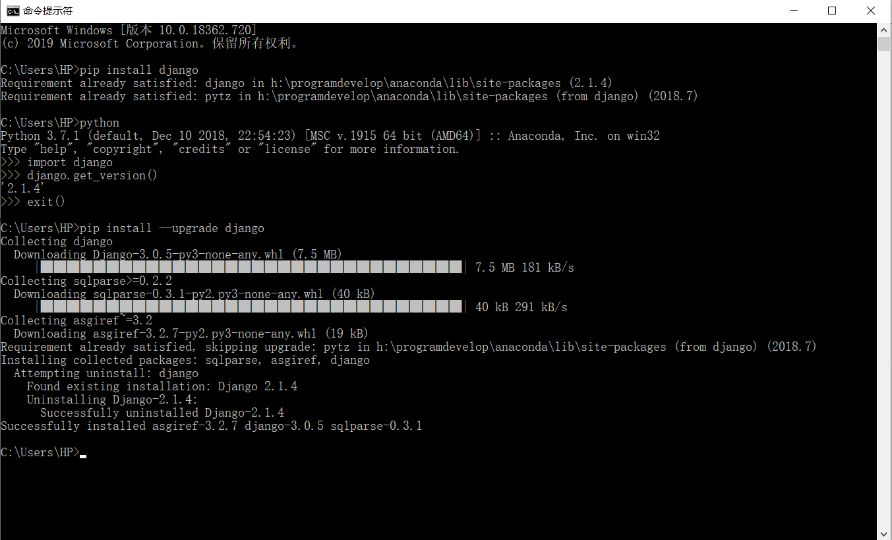

### Django学习笔记

### 网站参考
- [Django官网](https://www.djangoproject.com/)
- [Django 教程 菜鸟教程](https://www.runoob.com/django/django-tutorial.html)
- [Django 教程 W3CSchool](https://www.w3cschool.cn/django/)

### 其它参考
- 建议先看下Python_advanced_learning 中的:
    - 03_Python_network_programming--->005_MSGI_Mini_Web 框架项目，理解 web 框架的基本原理
    - MSGI_Mini_Web 框架实现了静态请求处理、动态请求处理、添加配置文件、添加路由功能、MySQL数据库查询等功能
    - [MSGI_Mini_Web 项目 GitHub 地址](https://github.com/FelixZFB/Python_advanced_learning/tree/master/03_Python_network_programming/005_MSGI_Mini_Web%E6%A1%86%E6%9E%B6)

# 1 Django 概述
## 1.1 为什么是 Django ?
- 使用Django，您可以在几个小时内将Web应用程序从概念转移到启动。
- Django负责Web开发的大部分麻烦，所以您可以专注于编写应用程序，而不需要重新发明方向盘。它是免费的，开源的。
- 速度快得离谱：Django的设计是为了帮助开发人员尽可能快地将应用程序从概念转移到完成。
- 功能丰富：Django包含了数十个可以用来处理常见Web开发任务的附加程序。Django负责用户身份验证、内容管理、站点地图、RSS提要和更多的任务--就在眼前。
- 安全可靠：Django非常重视安全性，并帮助开发人员避免许多常见的安全错误，例如SQL注入、跨站点脚本编写、跨站点请求伪造和点击劫持。它的用户认证系统为管理用户帐户和密码提供了一种安全的方法。
- 可扩展性：利用Django的能力，快速、灵活地扩展规模，以满足最大的使用需求。
- 适用性广：公司、组织和政府使用Django构建了各种各样的东西--从内容管理系统到社交网络，再到科学计算平台

## 1.2 Django 安装
- [Django官网](https://www.djangoproject.com/)
- Windows环境
    - Windows本地安装，直接CMD终端：
        - pip install django            自动拉取最新版
        - pip install django=3.0.5      安装指定版本
        - pip install --upgrade django  升级本地版本为最新版本
        - 由于我本地只安装了anaconda环境，没有安装其它python版本
        - pip直接安装都是安装在anaconda环境下的包里面
        
    - Ubuntu安装，安装方法类似
        - 先安装虚拟环境，新建一个虚拟环境，进入虚拟环境安装django和新建django项目
        - 参考Django框架教程新(HTML版_直接打开index查看)的1.1 1.2 
        - 以及 Django 教程网站的安装教程有详细说明
    - Pycharm安装(推荐使用该方法)
            - 方法1：进入虚拟环境后，安装pip安装
            - 方法2：直接pycharm里面包管理搜索安装
            - 添加pycharm源地址为国内镜像地址
            - 参考QQ浏览器收藏夹pycharm使用或[pycharm修改镜像源方法](https://blog.csdn.net/selfimpro_001/article/details/88670584)
    
## 1.3 MVC    
- MVC框架的核心思想是：解耦，让不同的代码块之间降低耦合，增强代码的可扩展性和可移植性，实现向后兼容。
- 当前主流的开发语言如Java、PHP、Python中都有MVC框架    